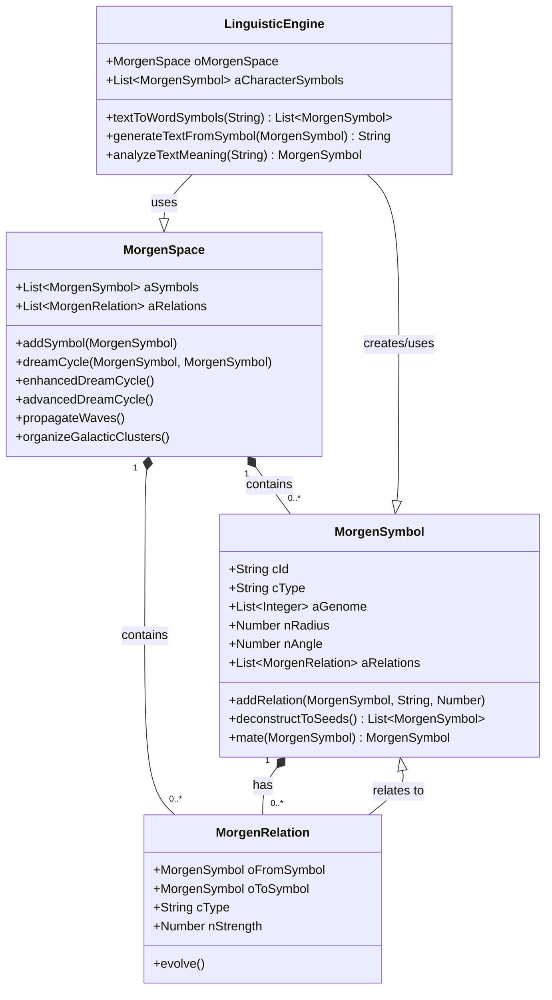

# Morgen AI - Class Diagram

## Description

- **`MorgenSpace`**: The central container for all symbols and relations. It orchestrates the main cognitive processes like the dream cycles.
- **`MorgenSymbol`**: The fundamental unit of knowledge. It has a unique position, a genetic code (`aGenome`), and can evolve through mating and deconstruction.
- **`MorgenRelation`**: Represents a directed, weighted link between two symbols, forming the knowledge graph.
- **`LinguisticEngine`**: The component responsible for translating between natural language and the symbolic representation within the `MorgenSpace`.

This diagram shows that the `MorgenSpace` is the core of the system, containing many `MorgenSymbol`s and `MorgenRelation`s. Each `MorgenSymbol` can have multiple `MorgenRelation`s connecting it to other symbols. The `LinguisticEngine` interacts with the `MorgenSpace` to analyze and generate language.
