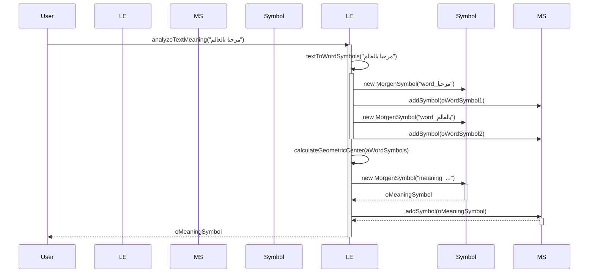

# Text Analysis - Sequence Diagram

This diagram illustrates the sequence of events when a user requests to analyze the meaning of a piece of text.

## Description

1.  **User Input:** The user calls the `analyzeTextMeaning` function on the `LinguisticEngine` with a string of text.
2.  **Word Symbolization:** The `LinguisticEngine` first calls its internal `textToWordSymbols` function. This function splits the text into words and creates a `MorgenSymbol` for each word (e.g., "مرحبا" and "بالعالم"). Each new word symbol is added to the `MorgenSpace`.
3.  **Meaning Symbol Creation:** The engine then calculates a geometric center based on the newly created word symbols.
4.  **New Symbol:** A new `MorgenSymbol` is created to represent the overall meaning of the text. Its position is based on the calculated center, and it contains references to the individual word symbols.
5.  **Add to Space:** This new "meaning symbol" is also added to the `MorgenSpace`.
6.  **Return:** The `LinguisticEngine` returns the final meaning symbol to the user.
