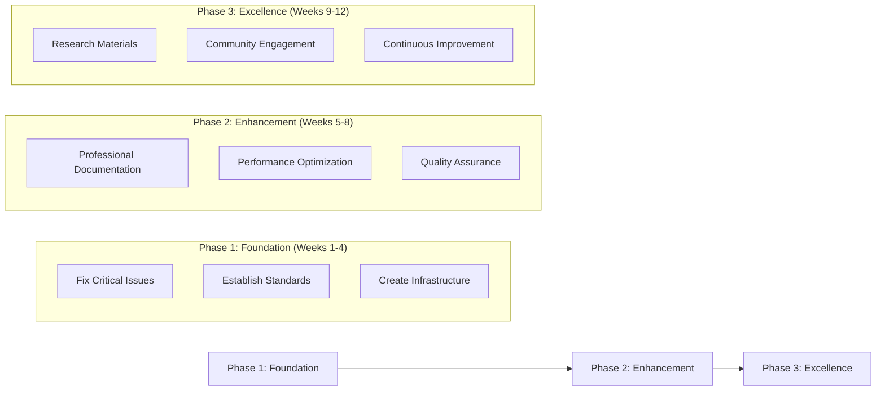
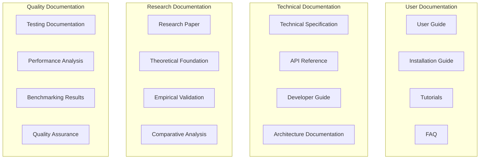

# Improvement Strategy - Morgen AI Paradigm

## Overview

This document outlines the comprehensive improvement strategy for transforming the Morgen AI Paradigm from its current state into a professional, research-grade AI system that meets academic and industry standards. The strategy addresses all critical issues identified and provides a roadmap for systematic improvement.

## 1. Strategic Objectives

### 1.1 Primary Goals
- **Professional Standards Compliance**: Meet industry-standard development practices
- **Academic Quality Achievement**: Reach research-grade documentation and validation
- **System Reliability**: Ensure robust, error-free operation
- **Clear Value Proposition**: Articulate specific capabilities and use cases
- **Research Recognition**: Gain recognition in academic and research communities

### 1.2 Success Metrics
- **Technical**: 100% test success rate, comprehensive documentation coverage
- **Academic**: Publication-ready research materials, peer review acceptance
- **Professional**: Industry-standard code quality, professional presentation
- **Community**: Positive feedback from users and researchers

## 2. Improvement Framework

### 2.1 Three-Phase Approach

### 2.2 Priority Matrix

| Priority | Category | Issues | Timeline |
|----------|----------|--------|----------|
| Critical | Testing Infrastructure | Test failures, path errors | Week 1-2 |
| Critical | System Purpose | Unclear capabilities, use cases | Week 1-2 |
| High | Documentation | Language, professional standards | Week 3-4 |
| High | Evaluation Framework | Performance metrics, benchmarking | Week 3-4 |
| Medium | Code Quality | Professional standards, optimization | Week 5-6 |
| Medium | Research Materials | Academic papers, theoretical analysis | Week 7-8 |
| Low | Advanced Features | Additional capabilities, extensions | Week 9-12 |

## 3. Documentation Strategy

### 3.1 Documentation Transformation Plan

#### Current State Issues
- **Language Barriers**: Mixed Arabic/English documentation
- **Unprofessional Presentation**: Inconsistent formatting and structure
- **Unclear Purpose**: Vague system capabilities and use cases
- **Missing Academic Quality**: Lack of theoretical foundation and empirical validation

#### Target State Goals
- **Professional English Documentation**: Clear, comprehensive, well-structured
- **Academic Quality**: Research-grade theoretical analysis and empirical validation
- **Clear Value Proposition**: Specific capabilities, use cases, and target audience
- **International Accessibility**: Documentation accessible to global research community

### 3.2 Documentation Architecture

### 3.3 Documentation Standards

#### Writing Standards
- **Language**: Professional English, clear and concise
- **Structure**: Logical organization with clear headings and sections
- **Formatting**: Consistent formatting using Markdown and professional templates
- **Accessibility**: Clear explanations suitable for diverse audiences

#### Content Standards
- **Completeness**: Comprehensive coverage of all system aspects
- **Accuracy**: Technically accurate and up-to-date information
- **Clarity**: Clear explanations with examples and illustrations
- **Professional Quality**: Suitable for academic and commercial use

## 4. Technical Improvement Strategy

### 4.1 Testing Infrastructure Overhaul

#### Immediate Actions (Week 1)
1. **Fix Path Resolution**: Implement dynamic path resolution system
2. **Resolve Class Conflicts**: Prevent class redefinition errors
3. **Replace eval() Usage**: Implement safer alternatives to dynamic code execution
4. **Dependency Management**: Resolve circular dependencies and missing imports

#### Testing Framework Implementation (Week 2)
1. **Test Infrastructure**: Create robust testing framework
2. **Test Organization**: Implement clear test structure and organization
3. **Automated Testing**: Set up continuous integration and automated testing
4. **Coverage Analysis**: Implement code coverage measurement and reporting

### 4.2 System Architecture Improvement

#### Architecture Redesign (Week 3-4)
1. **Layer Separation**: Implement clear architectural layers
2. **Component Modularity**: Create modular, testable components
3. **Interface Standardization**: Standardize component interfaces
4. **Error Handling**: Implement professional error handling patterns

#### Performance Optimization (Week 5-6)
1. **Performance Monitoring**: Implement performance tracking
2. **Resource Management**: Optimize memory and resource usage
3. **Scalability**: Design for horizontal and vertical scaling
4. **Efficiency**: Optimize algorithms and data structures

## 5. Research and Academic Strategy

### 5.1 Research Quality Enhancement

#### Theoretical Foundation (Week 7)
1. **Mathematical Formalization**: Formalize cognitive space concepts
2. **Algorithmic Analysis**: Analyze computational complexity
3. **Theoretical Justification**: Provide theoretical basis for design choices
4. **Literature Review**: Position work within existing research

#### Empirical Validation (Week 8)
1. **Experimental Design**: Design rigorous experiments
2. **Statistical Analysis**: Implement statistical significance testing
3. **Benchmark Comparison**: Compare with established benchmarks
4. **Result Validation**: Validate results through multiple methods

### 5.2 Academic Publication Strategy

#### Research Paper Development (Week 9-10)
1. **Paper Structure**: Follow academic paper structure and standards
2. **Novel Contributions**: Clearly articulate innovative contributions
3. **Experimental Results**: Present comprehensive experimental results
4. **Peer Review Preparation**: Prepare for academic peer review process

#### Community Engagement (Week 11-12)
1. **Conference Submissions**: Submit to relevant academic conferences
2. **Journal Publications**: Prepare for journal publication
3. **Open Source**: Release as open-source research project
4. **Community Building**: Engage with research community

## 6. Quality Assurance Strategy

### 6.1 Code Quality Standards

#### Professional Development Practices
- **Code Standards**: Implement consistent coding standards
- **Documentation**: Comprehensive inline code documentation
- **Error Handling**: Robust error handling and recovery
- **Testing**: Comprehensive test coverage for all components

#### Quality Metrics
- **Code Coverage**: Minimum 80% test coverage
- **Documentation Coverage**: Complete API and function documentation
- **Error Handling**: All error conditions properly handled
- **Performance**: Meet established performance benchmarks

### 6.2 Continuous Improvement Process

#### Quality Monitoring
1. **Automated Quality Checks**: Implement automated quality assurance
2. **Performance Monitoring**: Continuous performance tracking
3. **User Feedback**: Collect and analyze user feedback
4. **Research Feedback**: Incorporate academic community feedback

#### Improvement Cycles
1. **Regular Reviews**: Quarterly quality and performance reviews
2. **Feedback Integration**: Systematic integration of feedback
3. **Continuous Updates**: Regular updates and improvements
4. **Version Management**: Professional version control and release management

## 7. Implementation Timeline

### 7.1 Detailed Schedule

| Week | Phase | Focus Area | Key Deliverables |
|------|-------|------------|------------------|
| 1-2 | Foundation | Testing Infrastructure | Fixed tests, test framework |
| 3-4 | Foundation | Documentation & Architecture | Professional docs, improved architecture |
| 5-6 | Enhancement | Performance & Quality | Optimized performance, quality standards |
| 7-8 | Enhancement | Research & Validation | Research materials, empirical validation |
| 9-10 | Excellence | Academic Materials | Research paper, theoretical analysis |
| 11-12 | Excellence | Community & Improvement | Community engagement, continuous improvement |

### 7.2 Milestone Tracking

#### Critical Milestones
- **Week 2**: All tests pass successfully
- **Week 4**: Professional documentation complete
- **Week 6**: Performance benchmarks established
- **Week 8**: Empirical validation complete
- **Week 10**: Research paper draft complete
- **Week 12**: Community engagement initiated

## 8. Risk Management

### 8.1 Risk Assessment

#### Technical Risks
- **Complexity**: System complexity may impede improvement efforts
- **Dependencies**: External dependencies may cause delays
- **Performance**: Performance optimization may require significant effort
- **Compatibility**: Changes may break existing functionality

#### Mitigation Strategies
- **Incremental Approach**: Make small, incremental improvements
- **Testing**: Comprehensive testing at each step
- **Backup Plans**: Maintain rollback capabilities
- **Expert Consultation**: Engage domain experts when needed

### 8.2 Success Factors

#### Critical Success Factors
1. **Leadership Commitment**: Strong commitment to improvement goals
2. **Resource Allocation**: Adequate time and resources for improvement
3. **Quality Focus**: Unwavering focus on quality and professional standards
4. **Community Engagement**: Active engagement with research community

#### Success Indicators
- **Technical**: All tests pass, performance meets benchmarks
- **Academic**: Research materials meet publication standards
- **Professional**: Code and documentation meet industry standards
- **Community**: Positive feedback from users and researchers

---

**Strategy Version**: 1.0  
**Implementation Approach**: Phased improvement with quality focus  
**Success Criteria**: Professional standards, academic quality, community recognition  
**Next Steps**: Begin Phase 1 implementation with testing infrastructure repair
