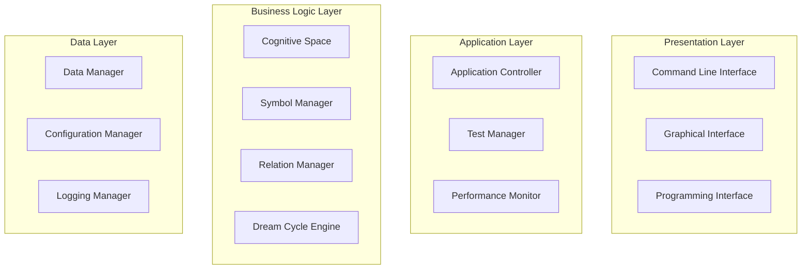

# Developer Guide - Morgen AI Paradigm

## Overview

This guide provides comprehensive information for developers who want to contribute to, extend, or integrate with the Morgen AI Paradigm system. It covers architecture, coding standards, development workflows, and contribution guidelines.

## Table of Contents

1. [Development Environment Setup](#1-development-environment-setup)
2. [System Architecture](#2-system-architecture)
3. [Coding Standards](#3-coding-standards)
4. [Core Components](#4-core-components)
5. [Testing Framework](#5-testing-framework)
6. [Performance Guidelines](#6-performance-guidelines)
7. [Contribution Workflow](#7-contribution-workflow)
8. [API Documentation](#8-api-documentation)

## 1. Development Environment Setup

### 1.1 Prerequisites

#### Required Software
- **Ring Language**: Version 1.17 or later
- **Git**: For version control
- **Text Editor**: VS Code with Ring extension recommended
- **Testing Tools**: Built-in testing framework

#### Development Tools
```bash
# Install Ring Language
# See installation_guide.md for detailed instructions

# Clone development repository
git clone https://github.com/morgen-ai/morgen-paradigm.git
cd morgen-paradigm

# Set up development environment
mkdir -p dev-tools
mkdir -p logs
mkdir -p temp
```

### 1.2 Project Structure

```
morgen-paradigm/
├── morgen/                     # Core system components
│   ├── space.ring             # Cognitive space management
│   ├── symbol.ring            # Symbol representation and operations
│   ├── relation.ring          # Relationship management
│   ├── geometry_utils.ring    # Geometric utilities
│   └── language/              # Language processing
│       ├── char_definitions.ring
│       └── linguistic_engine.ring
├── tests/                     # Test suites
│   ├── fixed/                 # Fixed test framework
│   ├── unit/                  # Unit tests
│   ├── integration/           # Integration tests
│   └── performance/           # Performance tests
├── gui/                       # Graphical user interface
├── config/                    # Configuration files
├── docs/                      # Documentation
├── examples/                  # Usage examples
└── dev-tools/                 # Development utilities
```

### 1.3 Development Configuration

#### Environment Variables
```bash
# Set development environment variables
export MORGEN_DEV=true
export MORGEN_LOG_LEVEL=DEBUG
export MORGEN_TEST_MODE=true
```

#### Development Configuration
```ring
# config/dev_config.ring
class DevConfig {
    # Development-specific settings
    bDebugMode = true
    bVerboseLogging = true
    bTestMode = true
    
    # Performance settings for development
    nMaxSymbols = 1000  # Reduced for faster testing
    nMaxDreamCycles = 10
    
    # Testing configuration
    bRunPerformanceTests = false
    bGenerateTestReports = true
}
```

## 2. System Architecture

### 2.1 Architectural Principles

#### Layered Architecture


#### Design Patterns Used
- **Observer Pattern**: For event-driven communication
- **Strategy Pattern**: For pluggable algorithms
- **Factory Pattern**: For object creation
- **Singleton Pattern**: For configuration management
- **Command Pattern**: For operation encapsulation

### 2.2 Core Interfaces

#### ICognitiveSpace Interface
```ring
class ICognitiveSpace {
    # Abstract interface for cognitive space implementations
    
    func addSymbol(oSymbol)
        # Add symbol to cognitive space
        
    func removeSymbol(cSymbolId)
        # Remove symbol from cognitive space
        
    func findSymbol(cSymbolId)
        # Find symbol by ID
        
    func enhancedDreamCycle()
        # Execute dream cycle processing
        
    func updateGlobalResonance()
        # Update global resonance state
}
```

#### ISymbol Interface
```ring
class ISymbol {
    # Abstract interface for symbol implementations
    
    func getId()
        # Get symbol identifier
        
    func getPosition()
        # Get polar coordinate position
        
    func getGenome()
        # Get symbol genome
        
    func mate(oOtherSymbol)
        # Mate with another symbol
        
    func deconstructToSeeds()
        # Deconstruct symbol to seeds
}
```

## 3. Coding Standards

### 3.1 Ring Language Conventions

#### Naming Conventions
```ring
# Classes: PascalCase
class MorgenSymbol {
    # Class members: camelCase with type prefix
    cId = ""           # String: c prefix
    nRadius = 0        # Number: n prefix
    aGenome = []       # Array: a prefix
    oRelation = null   # Object: o prefix
    bIsActive = true   # Boolean: b prefix
    
    # Functions: camelCase
    func calculateDistance(oOtherSymbol) {
        # Function implementation
    }
    
    # Private functions: underscore prefix
    func _validateGenome(aGenome) {
        # Private function implementation
    }
}

# Constants: UPPER_CASE
MAX_SYMBOLS = 10000
DEFAULT_HORN_DEPTH = 5
```

#### Code Organization
```ring
# File header template
# ==============================================================================
# File: filename.ring
# Description: Brief description of file purpose
# Author: Developer name
# Created: Date
# Modified: Date
# ==============================================================================

# Load dependencies
load "required_file.ring"

# Constants
CONSTANT_NAME = value

# Global variables (minimize usage)
gVariableName = value

# Classes
class ClassName {
    # Class implementation
}

# Functions
func functionName() {
    # Function implementation
}

# Main execution (if applicable)
if isMainSourceFile() {
    # Main execution code
}
```

### 3.2 Documentation Standards

#### Function Documentation
```ring
/*
Function: calculatePolarDistance
Description: Calculates distance between two points in polar coordinate system
Parameters:
    nR1 (Number): Radius of first point
    nTheta1 (Number): Angle of first point in radians
    nR2 (Number): Radius of second point
    nTheta2 (Number): Angle of second point in radians
Returns:
    Number: Distance between the two points
Example:
    nDistance = calculatePolarDistance(5.0, 1.57, 3.0, 0.78)
Notes:
    Uses standard polar distance formula
    Angles should be in radians, not degrees
*/
func calculatePolarDistance(nR1, nTheta1, nR2, nTheta2) {
    # Implementation
}
```

#### Class Documentation
```ring
/*
Class: MorgenSymbol
Description: Represents a cognitive symbol in the Morgen AI paradigm
Responsibilities:
    - Maintain symbol identity and properties
    - Handle symbol relationships and interactions
    - Support dream cycle processing operations
Usage:
    oSymbol = new MorgenSymbol("id", "type", [1,2,3], 5.0, 45.0, null)
Dependencies:
    - geometry_utils.ring for distance calculations
    - relation.ring for relationship management
*/
class MorgenSymbol {
    # Class implementation
}
```

### 3.3 Error Handling Standards

#### Exception Handling Pattern
```ring
func processSymbol(oSymbol) {
    # Input validation
    if not isObject(oSymbol) {
        raise("VALIDATION_ERROR: Invalid symbol object")
    }
    
    if oSymbol.cId = "" {
        raise("VALIDATION_ERROR: Symbol ID cannot be empty")
    }
    
    # Processing with error handling
    try {
        # Main processing logic
        nResult = performComplexOperation(oSymbol)
        
        # Result validation
        if nResult < 0 {
            raise("PROCESSING_ERROR: Invalid result value")
        }
        
        return nResult
        
    } catch cError {
        # Log error with context
        logError("processSymbol failed for " + oSymbol.cId + ": " + cError)
        
        # Re-throw with additional context
        raise("SYSTEM_ERROR: Symbol processing failed - " + cError)
    }
}
```

#### Error Categories
```ring
# System errors - critical system failures
raise("SYSTEM_ERROR: " + cMessage)

# Validation errors - invalid input or state
raise("VALIDATION_ERROR: " + cMessage)

# Processing errors - errors during normal processing
raise("PROCESSING_ERROR: " + cMessage)

# Configuration errors - invalid configuration
raise("CONFIG_ERROR: " + cMessage)
```

## 4. Core Components

### 4.1 Cognitive Space Component

#### Implementation Guidelines
```ring
class MorgenSpace {
    # Core properties
    aSymbols = []
    nHornDepth = 5
    nGlobalResonance = 0.0
    
    # Performance optimization
    aSymbolIndex = []  # For fast symbol lookup
    aSpatialIndex = [] # For spatial queries
    
    func addSymbol(oSymbol) {
        # Validate input
        if not isObject(oSymbol) {
            raise("VALIDATION_ERROR: Must add MorgenSymbol object")
        }
        
        # Add to main collection
        add(aSymbols, oSymbol)
        
        # Update indices for performance
        updateSymbolIndex(oSymbol)
        updateSpatialIndex(oSymbol)
        
        # Log operation
        logDebug("Added symbol: " + oSymbol.cId)
    }
    
    # Performance-optimized symbol search
    func findSymbol(cId) {
        # Use index for O(1) lookup instead of O(n) search
        if cId in aSymbolIndex {
            return aSymbolIndex[cId]
        }
        return null
    }
}
```

### 4.2 Symbol Component

#### Symbol Lifecycle Management
```ring
class MorgenSymbol {
    # Lifecycle states
    STATE_CREATED = 1
    STATE_ACTIVE = 2
    STATE_MATING = 3
    STATE_DECONSTRUCTED = 4
    STATE_ARCHIVED = 5
    
    nState = STATE_CREATED
    
    func setState(nNewState) {
        # Validate state transition
        if not isValidStateTransition(nState, nNewState) {
            raise("VALIDATION_ERROR: Invalid state transition")
        }
        
        # Log state change
        logDebug("Symbol " + cId + " state: " + nState + " -> " + nNewState)
        
        nState = nNewState
        
        # Trigger state-specific actions
        onStateChanged(nNewState)
    }
    
    func onStateChanged(nNewState) {
        # Override in subclasses for state-specific behavior
        switch nNewState {
            case STATE_ACTIVE
                activateSymbol()
            case STATE_ARCHIVED
                archiveSymbol()
        }
    }
}
```

## 5. Testing Framework

### 5.1 Test Organization

#### Test Structure
```ring
# tests/unit/test_symbol.ring
load "../fixed/test_framework.ring"

class TestMorgenSymbol {
    oTestFramework = null
    
    func init() {
        oTestFramework = new TestFramework()
        oTestFramework.init()
    }
    
    func runAllTests() {
        testSymbolCreation()
        testSymbolMating()
        testSymbolDeconstruction()
        testSymbolValidation()
    }
    
    func testSymbolCreation() {
        see "Testing symbol creation..." + nl
        
        # Test valid symbol creation
        oSymbol = new MorgenSymbol("test1", "concept", [1,2,3], 5.0, 45.0, null)
        assert(oSymbol.cId = "test1", "Symbol ID should be set correctly")
        assert(len(oSymbol.aGenome) = 3, "Genome should have 3 elements")
        
        # Test invalid symbol creation
        try {
            oInvalidSymbol = new MorgenSymbol("", "concept", [], 0, 0, null)
            assert(false, "Should raise error for empty ID")
        } catch cError {
            assert(true, "Correctly raised error for invalid input")
        }
        
        see "✅ Symbol creation tests passed" + nl
    }
}
```

### 5.2 Test Utilities

#### Assertion Framework
```ring
func assert(bCondition, cMessage) {
    if not bCondition {
        raise("ASSERTION_ERROR: " + cMessage)
    }
}

func assertEqual(xExpected, xActual, cMessage) {
    if xExpected != xActual {
        cError = cMessage + " - Expected: " + string(xExpected) + 
                 ", Actual: " + string(xActual)
        raise("ASSERTION_ERROR: " + cError)
    }
}

func assertNotNull(xValue, cMessage) {
    if xValue = null {
        raise("ASSERTION_ERROR: " + cMessage + " - Value should not be null")
    }
}
```

## 6. Performance Guidelines

### 6.1 Optimization Principles

#### Memory Management
```ring
# Efficient memory usage patterns
class EfficientSymbolManager {
    # Use object pooling for frequently created objects
    aSymbolPool = []
    
    func getSymbol() {
        if len(aSymbolPool) > 0 {
            return aSymbolPool[len(aSymbolPool)]  # Reuse existing
            del(aSymbolPool, len(aSymbolPool))
        } else {
            return new MorgenSymbol()  # Create new if pool empty
        }
    }
    
    func releaseSymbol(oSymbol) {
        # Clean symbol state
        oSymbol.reset()
        
        # Return to pool for reuse
        add(aSymbolPool, oSymbol)
    }
}
```

#### Algorithm Optimization
```ring
# Use efficient data structures and algorithms
func optimizedSymbolSearch(aSymbols, cTargetId) {
    # Use binary search for sorted arrays
    # Use hash tables for O(1) lookup
    # Avoid linear search when possible
    
    if isSorted(aSymbols) {
        return binarySearch(aSymbols, cTargetId)
    } else {
        return linearSearch(aSymbols, cTargetId)
    }
}
```

### 6.2 Performance Monitoring

#### Built-in Profiling
```ring
class PerformanceProfiler {
    aTimings = []
    
    func startTiming(cOperation) {
        aTimings[cOperation] = clock()
    }
    
    func endTiming(cOperation) {
        if cOperation in aTimings {
            nElapsed = clock() - aTimings[cOperation]
            logPerformance(cOperation + " took " + nElapsed + "ms")
            return nElapsed
        }
        return 0
    }
}
```

## 7. Contribution Workflow

### 7.1 Development Process

#### Feature Development
1. **Create Feature Branch**: `git checkout -b feature/new-feature`
2. **Implement Feature**: Follow coding standards and write tests
3. **Run Tests**: Ensure all tests pass
4. **Update Documentation**: Update relevant documentation
5. **Submit Pull Request**: Create PR with detailed description

#### Bug Fixes
1. **Create Bug Branch**: `git checkout -b bugfix/issue-number`
2. **Write Test**: Create test that reproduces the bug
3. **Fix Bug**: Implement fix while ensuring test passes
4. **Verify Fix**: Run full test suite
5. **Submit Pull Request**: Include test and fix

### 7.2 Code Review Guidelines

#### Review Checklist
- [ ] Code follows established coding standards
- [ ] All functions have proper documentation
- [ ] Tests are included and pass
- [ ] Performance impact is considered
- [ ] Error handling is appropriate
- [ ] Documentation is updated

## 8. API Documentation

### 8.1 Core API

#### MorgenSpace API
```ring
# Create cognitive space
oSpace = new MorgenSpace(nHornDepth)

# Add symbols
oSpace.addSymbol(oSymbol)

# Execute dream cycle
oSpace.enhancedDreamCycle()

# Query symbols
oSymbol = oSpace.findSymbol(cId)
aSymbols = oSpace.findNearestSymbols(oPosition, nCount)
```

#### MorgenSymbol API
```ring
# Create symbol
oSymbol = new MorgenSymbol(cId, cType, aGenome, nRadius, nAngle, oData)

# Symbol operations
oOffspring = oSymbol.mate(oOtherSymbol)
aSeeds = oSymbol.deconstructToSeeds()
nDistance = oSymbol.calculateDistance(oOtherSymbol)
```

### 8.2 Extension Points

#### Custom Symbol Types
```ring
class CustomSymbol from MorgenSymbol {
    # Override methods for custom behavior
    func mate(oOtherSymbol) {
        # Custom mating logic
        return super.mate(oOtherSymbol)
    }
}
```

#### Custom Dream Cycle Phases
```ring
class CustomDreamCycle {
    func customHallPhase(oSpace) {
        # Custom decomposition logic
    }
    
    func customLammPhase(oSpace) {
        # Custom recombination logic
    }
    
    func customHulmPhase(oSpace) {
        # Custom integration logic
    }
}
```

---

**Developer Guide Version**: 1.0  
**Target Audience**: Contributors, Developers, Researchers  
**Maintenance**: Updated with each major release  
**Last Updated**: 2025-01-25
