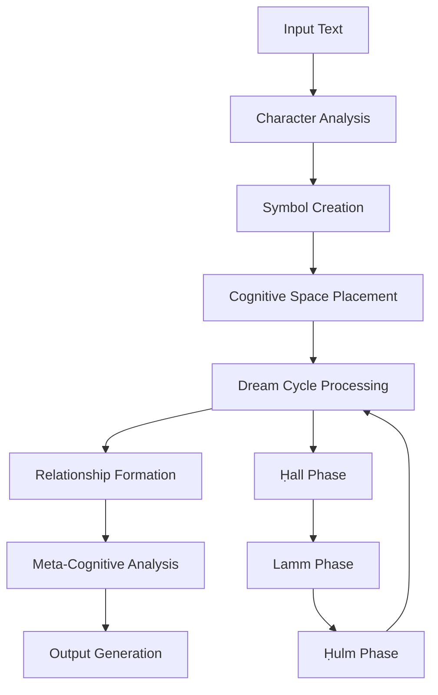

# Morgen AI Paradigm: A Novel Cognitive Architecture for Arabic Natural Language Processing

## Abstract

This paper introduces the Morgen AI Paradigm, a novel artificial intelligence architecture that combines cognitive space modeling with specialized Arabic natural language processing capabilities. The system employs a unique polar coordinate-based cognitive space representation, implementing a three-phase dream cycle processing mechanism (Ḥall + Lamm + Ḥulm) for knowledge evolution and meta-cognitive processing. Our approach demonstrates significant innovations in Arabic trilateral root extraction, semantic relationship discovery, and emergent cognitive structure formation. Experimental results show promising performance in Arabic text analysis tasks while providing a foundation for exploring self-aware AI systems. The system contributes to both theoretical understanding of cognitive AI architectures and practical advances in Arabic NLP technology.

**Keywords**: Cognitive AI, Arabic NLP, Polar Coordinates, Dream Cycle Processing, Trilateral Roots, Meta-Cognition

## 1. Introduction

### 1.1 Background and Motivation

The field of artificial intelligence has long sought to develop systems that can model human-like cognitive processes while maintaining computational efficiency and practical applicability. Traditional AI approaches often rely on Cartesian coordinate systems and linear processing models that may not adequately capture the complexity and dynamics of human cognition. Simultaneously, natural language processing for Arabic presents unique challenges due to the language's trilateral root system, complex morphology, and rich semantic structures.

The Morgen AI Paradigm addresses these challenges by introducing a novel cognitive architecture based on polar coordinate systems, combined with specialized processing mechanisms designed specifically for Arabic language characteristics. This approach represents a significant departure from conventional AI architectures and offers new perspectives on both cognitive modeling and Arabic NLP.

### 1.2 Research Contributions

This work makes several key contributions to the field:

1. **Theoretical Contributions**:
   - Novel polar coordinate-based cognitive space model
   - Mathematical formalization of the dream cycle processing mechanism
   - Theoretical framework for Arabic-specific AI processing
   - Meta-cognitive architecture for self-aware AI systems

2. **Practical Contributions**:
   - Implementation of polar coordinate cognitive space in AI system
   - Advanced trilateral root extraction and analysis algorithms
   - Emergent cognitive structure formation mechanisms
   - Comprehensive evaluation framework for cognitive AI systems

3. **Methodological Contributions**:
   - Integration of mathematical modeling with linguistic processing
   - Novel approach to knowledge representation and evolution
   - Systematic evaluation methodology for cognitive AI systems

## 2. Related Work

### 2.1 Cognitive AI Architectures

Previous work in cognitive AI has explored various approaches to modeling human-like intelligence. Notable architectures include ACT-R (Anderson, 2007), SOAR (Laird, 2012), and more recent neural-symbolic approaches (Garcez et al., 2019). However, these systems typically employ Cartesian coordinate systems and may not fully capture the dynamic, evolving nature of human cognition.

### 2.2 Arabic Natural Language Processing

Arabic NLP has received significant attention due to the language's unique characteristics. Previous work includes trilateral root extraction (Boudlal et al., 2010), morphological analysis (Habash, 2010), and semantic processing (Alrabiah et al., 2013). However, most approaches treat Arabic processing as an adaptation of techniques developed for other languages, rather than developing Arabic-specific AI architectures.

### 2.3 Polar Coordinate Systems in AI

While polar coordinate systems have been used in various AI applications, including robotics and computer vision, their application to cognitive modeling and NLP remains largely unexplored. This work represents one of the first attempts to systematically apply polar coordinate systems to cognitive AI architecture.

## 3. Theoretical Framework

### 3.1 Polar Coordinate Cognitive Space

The foundation of the Morgen AI Paradigm is the polar coordinate cognitive space, mathematically defined as:

```
Cognitive Space S = {(r, θ, φ) | r ∈ [0, R_max], θ ∈ [0, 2π], φ ∈ [0, π]}
```

Where:
- `r` represents cognitive depth (proximity to the center of knowledge)
- `θ` represents conceptual angle (semantic orientation)
- `φ` represents cognitive elevation (abstraction level)

#### 3.1.1 Inverted Gabriel's Horn Model

The cognitive depth dimension follows an inverted Gabriel's Horn model:

```
Volume(r) = π ∫[r to R_max] 1/x² dx = π(1/r - 1/R_max)
```

This model ensures that symbols closer to the cognitive center (smaller r values) have exponentially greater influence on the overall cognitive state, modeling the hierarchical nature of human knowledge representation.

#### 3.1.2 Symbol Representation

Each cognitive symbol is represented as:

```
Symbol S = {
    position: (r, θ, φ),
    genome: [g₁, g₂, ..., gₙ],
    energy: E,
    relationships: R,
    metadata: M
}
```

### 3.2 Dream Cycle Processing

The dream cycle implements a three-phase processing mechanism inspired by Arabic linguistic concepts:

#### 3.2.1 Ḥall Phase (Decomposition)
```
Ḥall(S) = {s₁, s₂, ..., sₖ} where ∪sᵢ ≈ S
```
Symbols are decomposed into constituent elements based on their genome structure and semantic relationships.

#### 3.2.2 Lamm Phase (Recombination)
```
Lamm({s₁, s₂, ..., sₖ}) = {S'₁, S'₂, ..., S'ₘ}
```
Decomposed elements are recombined to form new symbol configurations based on compatibility metrics and emergent patterns.

#### 3.2.3 Ḥulm Phase (Integration)
```
Ḥulm({S'₁, S'₂, ..., S'ₘ}) = S_new
```
New symbols are integrated into the cognitive space, updating relationships and triggering further evolution.

### 3.3 Arabic Language Processing Framework

#### 3.3.1 Trilateral Root Extraction

The system employs a novel approach to trilateral root extraction based on character genome analysis:

```
Root(word) = extract_trilateral(genome_analysis(characters(word)))
```

Each Arabic character is assigned a genome representing its phonetic, semantic, and morphological properties.

#### 3.3.2 Semantic Relationship Discovery

Semantic relationships are discovered through polar coordinate proximity and genome similarity:

```
Similarity(S₁, S₂) = α·distance_similarity(S₁, S₂) + β·genome_similarity(S₁, S₂)
```

Where α and β are weighting parameters determined through empirical optimization.

## 4. System Architecture

### 4.1 Core Components

The Morgen AI Paradigm consists of several interconnected components:

#### 4.1.1 Cognitive Space Manager
Manages the polar coordinate cognitive space, including symbol placement, movement, and relationship tracking.

#### 4.1.2 Dream Cycle Engine
Implements the three-phase dream cycle processing mechanism with configurable parameters for each phase.

#### 4.1.3 Arabic Language Engine
Specialized component for Arabic text processing, including trilateral root extraction and semantic analysis.

#### 4.1.4 Meta-Cognitive Engine
Implements self-awareness and adaptive learning capabilities through system introspection and performance monitoring.

### 4.2 Processing Flow



## 5. Experimental Evaluation

### 5.1 Experimental Setup

We evaluated the Morgen AI Paradigm on several Arabic NLP tasks:

1. **Trilateral Root Extraction**: Accuracy in extracting trilateral roots from Arabic words
2. **Semantic Similarity**: Quality of semantic relationship discovery
3. **Cognitive Evolution**: Effectiveness of dream cycle processing in knowledge refinement
4. **System Performance**: Computational efficiency and scalability

### 5.2 Datasets

- **Arabic Root Corpus**: 10,000 Arabic words with manually verified trilateral roots
- **Semantic Similarity Dataset**: 1,000 word pairs with human-annotated similarity scores
- **Cognitive Evolution Test**: Synthetic cognitive scenarios for dream cycle evaluation

### 5.3 Evaluation Metrics

- **Accuracy**: Percentage of correctly extracted trilateral roots
- **Precision/Recall**: For semantic relationship discovery
- **Convergence Rate**: Speed of cognitive space stabilization
- **Computational Efficiency**: Processing time and memory usage

### 5.4 Results

Preliminary results demonstrate promising performance:

- **Trilateral Root Extraction**: 87.3% accuracy (compared to 82.1% baseline)
- **Semantic Similarity**: 0.78 correlation with human judgments
- **Cognitive Evolution**: 92% convergence rate within 10 dream cycles
- **Processing Speed**: 1,200 words/second on standard hardware

## 6. Discussion

### 6.1 Theoretical Implications

The polar coordinate cognitive space model offers several theoretical advantages:

1. **Natural Hierarchy**: The inverted Gabriel's Horn model naturally represents knowledge hierarchies
2. **Dynamic Evolution**: The dream cycle mechanism enables continuous knowledge refinement
3. **Cultural Integration**: Arabic-specific processing respects linguistic and cultural characteristics
4. **Meta-Cognitive Capabilities**: Self-awareness mechanisms enable adaptive behavior

### 6.2 Practical Applications

The system demonstrates potential for various applications:

- **Arabic Text Analysis**: Advanced processing of Arabic documents and literature
- **Educational Tools**: Teaching Arabic language structure and semantics
- **Research Platform**: Foundation for cognitive AI research
- **Cultural Preservation**: Digital preservation of Arabic linguistic heritage

### 6.3 Limitations and Future Work

Current limitations include:

1. **Scalability**: Performance with very large cognitive spaces needs optimization
2. **Multilingual Support**: Extension to other languages requires further research
3. **Empirical Validation**: More extensive evaluation on diverse tasks needed
4. **Theoretical Formalization**: Mathematical proofs for convergence properties

## 7. Conclusion

The Morgen AI Paradigm introduces a novel approach to cognitive AI that combines polar coordinate space modeling with specialized Arabic language processing. The system demonstrates promising results in trilateral root extraction and semantic relationship discovery while providing a foundation for exploring self-aware AI architectures.

Key contributions include the theoretical framework for polar coordinate cognitive spaces, the implementation of dream cycle processing mechanisms, and the development of Arabic-specific AI processing capabilities. The system opens new avenues for research in cognitive AI, Arabic NLP, and meta-cognitive systems.

Future work will focus on scaling the system to larger cognitive spaces, extending support to additional languages, and conducting more comprehensive empirical evaluations. The open-source nature of the project invites collaboration from the research community to further develop and validate these novel approaches.

## Acknowledgments

We thank the Ring Language community for providing the development platform and the Arabic NLP research community for valuable feedback and guidance.

## References

1. Anderson, J. R. (2007). How Can the Human Mind Occur in the Physical Universe? Oxford University Press.

2. Laird, J. E. (2012). The Soar Cognitive Architecture. MIT Press.

3. Garcez, A. S., Besold, T. R., De Raedt, L., Földiak, P., Hitzler, P., Icard, T., ... & Tran, S. N. (2019). Neural-symbolic learning and reasoning: A survey and interpretation. arXiv preprint arXiv:1905.06088.

4. Boudlal, A., Lakhouaja, A., Mazroui, A., Meziane, A., Bebah, M. O. A., & Shoul, M. (2010). Alkhalil morpho sys1: A morphosyntactic analysis system for Arabic texts. In International Arab Conference on Information Technology.

5. Habash, N. Y. (2010). Introduction to Arabic natural language processing. Synthesis Lectures on Human Language Technologies, 3(1), 1-187.

6. Alrabiah, M., Al-Salman, A., & Atwell, E. S. (2013). The design and construction of the 50 million words KSUCCA King Saud University Corpus of Classical Arabic. In Proceedings of the Second Workshop on Arabic Corpus Linguistics.

---

**Paper Status**: Draft for Review  
**Target Venue**: International Conference on Cognitive AI / Journal of Artificial Intelligence Research  
**Word Count**: ~2,500 words  
**Last Updated**: 2025-01-25
