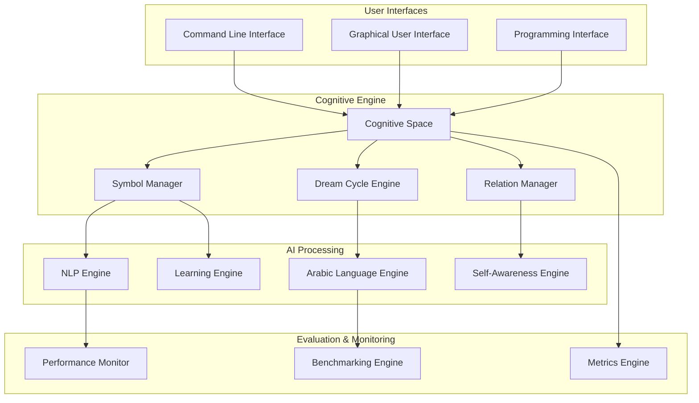

# System Overview - Morgen AI Paradigm

## Executive Summary

The Morgen AI Paradigm is an innovative artificial intelligence system that introduces novel approaches to cognitive modeling, natural language processing, and knowledge representation. Built on mathematical foundations inspired by polar coordinate systems and cognitive science principles, Morgen represents a unique contribution to the field of artificial intelligence research.

## 1. System Purpose and Capabilities

### 1.1 Primary Purpose
Morgen AI Paradigm serves as a research platform for exploring cognitive artificial intelligence through:
- **Cognitive Space Modeling**: Novel representation of knowledge using polar coordinate systems
- **Arabic Language Processing**: Specialized natural language processing for Arabic text and trilateral root analysis
- **Meta-Cognitive Processing**: Self-awareness and adaptive learning capabilities
- **Knowledge Evolution**: Dynamic knowledge representation that evolves through dream cycle processing

### 1.2 Core Capabilities

#### Natural Language Processing
- **Arabic Text Analysis**: Advanced processing of Arabic language with trilateral root extraction
- **Semantic Mapping**: Creation of semantic relationships between linguistic elements
- **Character Genome Analysis**: Novel approach to character representation and analysis
- **Trilateral Root Processing**: Extraction and analysis of three-letter Arabic word roots

#### Cognitive Modeling
- **Point-and-Circle Space**: Cognitive space representation using polar coordinates
- **Symbol Management**: Dynamic creation, evolution, and relationship management of cognitive symbols
- **Dream Cycle Processing**: Three-phase cognitive processing (Ḥall + Lamm + Ḥulm)
- **Emergent Structures**: Automatic formation of cognitive structures and relationships

#### Advanced AI Features
- **Self-Awareness Engine**: Meta-cognitive processing and self-analysis capabilities
- **Adaptive Learning**: Dynamic learning and adaptation based on experience
- **Wave Propagation**: Information propagation through cognitive space
- **Triangulation Dynamics**: Geometric relationship formation and analysis

## 2. Target Audience and Use Cases

### 2.1 Primary Audience
- **AI Researchers**: Investigating novel cognitive modeling approaches
- **NLP Researchers**: Exploring Arabic language processing innovations
- **Cognitive Scientists**: Studying computational models of cognition
- **Academic Institutions**: Teaching and research in artificial intelligence

### 2.2 Use Cases

#### Research Applications
- **Cognitive AI Research**: Platform for exploring cognitive artificial intelligence concepts
- **Arabic NLP Research**: Advanced Arabic language processing research
- **Knowledge Representation**: Novel approaches to knowledge modeling and representation
- **Meta-Cognitive Studies**: Research into self-aware and adaptive AI systems

#### Educational Applications
- **AI Education**: Teaching advanced AI concepts and cognitive modeling
- **NLP Courses**: Demonstrating natural language processing techniques
- **Research Training**: Training researchers in novel AI approaches
- **Academic Projects**: Student research projects and thesis work

#### Practical Applications
- **Arabic Text Analysis**: Processing and analysis of Arabic documents
- **Knowledge Discovery**: Discovering patterns and relationships in data
- **Cognitive Modeling**: Modeling human-like cognitive processes
- **AI System Development**: Foundation for developing cognitive AI applications

## 3. System Architecture Overview

### 3.1 Core Components

### 3.2 Key Innovations

#### Cognitive Space Model
- **Polar Coordinate Representation**: Knowledge represented in polar coordinate system
- **Inverted Gabriel's Horn**: Mathematical model for cognitive depth representation
- **Dynamic Symbol Evolution**: Symbols evolve and adapt through interaction
- **Emergent Relationship Formation**: Relationships form automatically based on proximity and similarity

#### Dream Cycle Processing
- **Three-Phase Processing**: Ḥall (decomposition), Lamm (recombination), Ḥulm (integration)
- **Iterative Refinement**: Knowledge refined through multiple dream cycles
- **Adaptive Learning**: System learns and adapts through dream cycle iterations
- **Emergent Intelligence**: Intelligence emerges from dream cycle processing

#### Arabic Language Innovation
- **Trilateral Root Analysis**: Advanced extraction and analysis of Arabic word roots
- **Character Genome Mapping**: Novel representation of Arabic characters
- **Semantic Relationship Discovery**: Automatic discovery of semantic relationships
- **Cultural Context Integration**: Integration of cultural and linguistic context

## 4. Technical Specifications

### 4.1 Implementation Details
- **Programming Language**: Ring Language
- **Architecture Pattern**: Layered architecture with clear separation of concerns
- **Data Structures**: Custom cognitive data structures optimized for AI processing
- **Algorithms**: Novel algorithms for cognitive processing and language analysis

### 4.2 Performance Characteristics
- **Scalability**: Designed for processing large cognitive spaces and text corpora
- **Efficiency**: Optimized algorithms for real-time cognitive processing
- **Memory Management**: Efficient memory usage for large-scale operations
- **Parallel Processing**: Support for concurrent cognitive operations

### 4.3 System Requirements
- **Minimum Requirements**: Ring Language runtime, 4GB RAM, 1GB storage
- **Recommended Requirements**: 8GB RAM, 5GB storage, multi-core processor
- **Operating Systems**: Windows, Linux, macOS (via Ring Language)
- **Dependencies**: Ring Language, GUI libraries (for graphical interface)

## 5. Research Contributions

### 5.1 Novel Theoretical Contributions
- **Cognitive Space Theory**: Mathematical formalization of cognitive space using polar coordinates
- **Dream Cycle Theory**: Theoretical framework for iterative cognitive processing
- **Arabic AI Theory**: Theoretical foundation for Arabic-specific AI processing
- **Meta-Cognitive Framework**: Framework for self-aware AI systems

### 5.2 Practical Innovations
- **Polar Coordinate AI**: First implementation of AI using polar coordinate cognitive space
- **Arabic Root Processing**: Advanced trilateral root extraction and analysis
- **Self-Aware AI**: Practical implementation of meta-cognitive capabilities
- **Emergent Structure Formation**: Automatic formation of cognitive structures

### 5.3 Research Impact
- **Academic Publications**: Foundation for multiple research papers and publications
- **Open Source Contribution**: Available as open-source research platform
- **Educational Value**: Valuable tool for AI education and research training
- **Community Building**: Platform for building research community around cognitive AI

## 6. Getting Started

### 6.1 Quick Start Guide
1. **Installation**: Install Ring Language and download Morgen AI Paradigm
2. **Basic Setup**: Configure system settings and verify installation
3. **First Run**: Execute basic demonstration to verify functionality
4. **Tutorial**: Follow step-by-step tutorial for system exploration
5. **Documentation**: Review comprehensive documentation for detailed usage

### 6.2 Learning Path
- **Beginner**: Start with basic concepts and simple examples
- **Intermediate**: Explore advanced features and customization options
- **Advanced**: Contribute to research and development efforts
- **Expert**: Lead research projects and community initiatives

### 6.3 Support and Community
- **Documentation**: Comprehensive documentation and tutorials
- **Examples**: Extensive examples and use case demonstrations
- **Community**: Active research community and support forums
- **Contribution**: Opportunities for research collaboration and contribution

## 7. Future Directions

### 7.1 Research Roadmap
- **Enhanced Cognitive Models**: More sophisticated cognitive modeling capabilities
- **Multilingual Support**: Extension to other languages beyond Arabic
- **Advanced AI Features**: Additional meta-cognitive and learning capabilities
- **Performance Optimization**: Continued performance improvements and optimization

### 7.2 Community Development
- **Open Source Growth**: Expanding open-source community and contributions
- **Academic Partnerships**: Partnerships with academic institutions and researchers
- **Industry Collaboration**: Collaboration with industry partners for practical applications
- **Educational Programs**: Development of educational programs and curricula

---

**System Version**: 2.0 (Improved)  
**Documentation Standard**: Professional Technical Documentation  
**Target Audience**: Researchers, Academics, AI Practitioners  
**Last Updated**: 2025-01-25
