# Evaluation Framework - Morgen AI Paradigm

## Overview

This document defines a comprehensive evaluation framework for the Morgen AI Paradigm system, addressing the critical lack of performance metrics, benchmarking capabilities, and quantitative validation methods. The framework establishes professional standards for measuring system effectiveness and comparing performance with existing AI systems.

## 1. Evaluation Architecture

```mermaid
graph TB
    subgraph "Evaluation Framework"
        EM[Evaluation Manager]
        ME[Metrics Engine]
        BE[Benchmarking Engine]
        CE[Comparison Engine]
        RE[Reporting Engine]
    end
    
    subgraph "Metrics Categories"
        PM[Performance Metrics]
        QM[Quality Metrics]
        EM_ACC[Accuracy Metrics]
        EM_EFF[Efficiency Metrics]
    end
    
    subgraph "Benchmarking"
        SB[Standard Benchmarks]
        CB[Custom Benchmarks]
        BB[Baseline Benchmarks]
        IB[Industry Benchmarks]
    end
    
    subgraph "Comparison Framework"
        SC[System Comparison]
        HC[Historical Comparison]
        BC[Baseline Comparison]
        PC[Peer Comparison]
    end
    
    subgraph "Reporting"
        DR[Detailed Reports]
        SR[Summary Reports]
        VR[Visual Reports]
        AR[Academic Reports]
    end
    
    EM --> ME
    EM --> BE
    EM --> CE
    EM --> RE
    
    ME --> PM
    ME --> QM
    ME --> EM_ACC
    ME --> EM_EFF
    
    BE --> SB
    BE --> CB
    BE --> BB
    BE --> IB
    
    CE --> SC
    CE --> HC
    CE --> BC
    CE --> PC
    
    RE --> DR
    RE --> SR
    RE --> VR
    RE --> AR
```



## 2. Performance Metrics Framework

### 2.1 Core Performance Metrics

#### Cognitive Processing Metrics
- **Symbol Processing Rate**: Symbols processed per second
- **Dream Cycle Efficiency**: Time per dream cycle completion
- **Memory Utilization**: Memory usage during processing
- **Convergence Rate**: Time to reach stable cognitive state

#### NLP Performance Metrics
- **Text Processing Speed**: Characters/words processed per second
- **Arabic Language Accuracy**: Accuracy in Arabic text analysis
- **Trilateral Root Extraction**: Success rate in root identification
- **Semantic Mapping Quality**: Quality of meaning associations

#### System Performance Metrics
- **Response Time**: System response time for various operations
- **Throughput**: Operations completed per unit time
- **Resource Utilization**: CPU, memory, and storage usage
- **Scalability**: Performance under increasing load

### 2.2 Quality Metrics

#### Accuracy Metrics
```ring
class AccuracyMetrics {
    func calculateSymbolAccuracy(aExpected, aActual) {
        nCorrect = 0
        nTotal = len(aExpected)
        
        for i = 1 to nTotal {
            if compareSymbols(aExpected[i], aActual[i]) {
                nCorrect++
            }
        }
        
        return (nCorrect / nTotal) * 100
    }
    
    func calculateSemanticAccuracy(aExpectedMeanings, aActualMeanings) {
        return calculateSemanticSimilarity(aExpectedMeanings, aActualMeanings)
    }
    
    func calculateArabicProcessingAccuracy(cText, aExpectedRoots, aActualRoots) {
        return calculateRootExtractionAccuracy(aExpectedRoots, aActualRoots)
    }
}
```

#### Reliability Metrics
- **System Stability**: Uptime and crash frequency
- **Result Consistency**: Consistency of results across runs
- **Error Rate**: Frequency of processing errors
- **Recovery Time**: Time to recover from failures

#### Usability Metrics
- **Learning Curve**: Time for users to become proficient
- **Task Completion Rate**: Success rate for user tasks
- **User Satisfaction**: Subjective user experience ratings
- **Documentation Quality**: Completeness and clarity of documentation

## 3. Benchmarking Framework

### 3.1 Standard NLP Benchmarks

#### Text Processing Benchmarks
- **GLUE Benchmark**: General Language Understanding Evaluation
- **SuperGLUE**: Advanced language understanding tasks
- **Arabic NLP Benchmarks**: Arabic-specific evaluation tasks
- **Cognitive AI Benchmarks**: Meta-cognitive processing evaluation

#### Custom Morgen Benchmarks
```ring
class MorgenBenchmarks {
    func dreamCycleBenchmark() {
        # Benchmark dream cycle processing
        aSymbols = createTestSymbols(1000)
        nStartTime = clock()
        
        for i = 1 to 100 {
            runDreamCycle(aSymbols)
        }
        
        nEndTime = clock()
        return calculatePerformanceMetrics(nStartTime, nEndTime)
    }
    
    func arabicProcessingBenchmark() {
        # Benchmark Arabic language processing
        aTexts = loadArabicTestTexts()
        aResults = []
        
        for cText in aTexts {
            nStartTime = clock()
            aRoots = extractTriliateralRoots(cText)
            nEndTime = clock()
            
            add(aResults, {
                "text": cText,
                "roots": aRoots,
                "time": nEndTime - nStartTime,
                "accuracy": validateRoots(aRoots, getExpectedRoots(cText))
            })
        }
        
        return aResults
    }
    
    func cognitiveSpaceBenchmark() {
        # Benchmark cognitive space operations
        oSpace = new MorgenSpace(10)
        return benchmarkSpaceOperations(oSpace)
    }
}
```

### 3.2 Performance Baselines

#### Baseline Establishment
- **Initial System Performance**: Current system performance baseline
- **Optimized Performance**: Performance after optimization
- **Target Performance**: Performance goals and targets
- **Industry Standards**: Comparison with industry-standard systems

#### Benchmark Categories
- **Micro-benchmarks**: Individual function performance
- **Component Benchmarks**: Component-level performance
- **System Benchmarks**: End-to-end system performance
- **Stress Tests**: Performance under extreme conditions

## 4. Comparison Framework

### 4.1 System Comparison Methodology

#### Comparison Criteria
- **Functional Capabilities**: Feature comparison with other systems
- **Performance Metrics**: Quantitative performance comparison
- **Quality Measures**: Output quality and accuracy comparison
- **Resource Requirements**: Resource usage and efficiency comparison

#### Comparison Implementation
```ring
class SystemComparison {
    func compareWithBaseline(oSystem, oBaseline) {
        aMetrics = ["accuracy", "speed", "memory", "quality"]
        aResults = []
        
        for cMetric in aMetrics {
            nSystemValue = measureMetric(oSystem, cMetric)
            nBaselineValue = measureMetric(oBaseline, cMetric)
            nImprovement = calculateImprovement(nSystemValue, nBaselineValue)
            
            add(aResults, {
                "metric": cMetric,
                "system": nSystemValue,
                "baseline": nBaselineValue,
                "improvement": nImprovement
            })
        }
        
        return aResults
    }
    
    func compareWithPeers(oSystem, aPeerSystems) {
        aComparisons = []
        
        for oPeer in aPeerSystems {
            aComparison = compareWithBaseline(oSystem, oPeer)
            add(aComparisons, {
                "peer": oPeer.cName,
                "comparison": aComparison
            })
        }
        
        return aComparisons
    }
}
```

### 4.2 Academic Evaluation Standards

#### Research Quality Metrics
- **Novelty Assessment**: Evaluation of innovative contributions
- **Theoretical Foundation**: Mathematical and theoretical rigor
- **Empirical Validation**: Experimental evidence and statistical significance
- **Reproducibility**: Ability to reproduce results

#### Publication Standards
- **Peer Review Readiness**: Quality suitable for academic publication
- **Citation Potential**: Likelihood of academic citation
- **Research Impact**: Potential impact on the field
- **Community Acceptance**: Acceptance by research community

## 5. Reporting Framework

### 5.1 Report Types

#### Technical Reports
- **Performance Analysis**: Detailed performance metrics and analysis
- **Benchmark Results**: Comprehensive benchmarking results
- **Comparison Studies**: Comparative analysis with other systems
- **Optimization Reports**: Performance optimization recommendations

#### Academic Reports
- **Research Papers**: Academic-quality research documentation
- **Conference Presentations**: Conference presentation materials
- **Journal Articles**: Journal publication-ready articles
- **Technical Specifications**: Detailed technical specifications

#### User Reports
- **User Guides**: Comprehensive user documentation
- **Tutorial Materials**: Step-by-step tutorials and examples
- **Best Practices**: Usage recommendations and best practices
- **Troubleshooting Guides**: Problem resolution documentation

### 5.2 Visualization and Analytics

#### Performance Dashboards
```ring
class PerformanceDashboard {
    func generateDashboard(aMetrics) {
        oDashboard = new Dashboard()
        
        # Add performance charts
        oDashboard.addChart("Performance Trends", createTrendChart(aMetrics))
        oDashboard.addChart("Accuracy Metrics", createAccuracyChart(aMetrics))
        oDashboard.addChart("Resource Usage", createResourceChart(aMetrics))
        oDashboard.addChart("Comparison Results", createComparisonChart(aMetrics))
        
        return oDashboard
    }
    
    func generateReport(aMetrics) {
        oReport = new Report()
        
        oReport.addSection("Executive Summary", createSummary(aMetrics))
        oReport.addSection("Detailed Analysis", createAnalysis(aMetrics))
        oReport.addSection("Recommendations", createRecommendations(aMetrics))
        oReport.addSection("Appendices", createAppendices(aMetrics))
        
        return oReport
    }
}
```

## 6. Implementation Plan

### 6.1 Phase 1: Basic Metrics (Weeks 1-2)
1. **Core Performance Metrics**: Implement basic performance measurement
2. **Simple Benchmarks**: Create basic benchmarking capabilities
3. **Basic Reporting**: Implement simple report generation
4. **Baseline Establishment**: Establish current performance baselines

### 6.2 Phase 2: Advanced Evaluation (Weeks 3-4)
1. **Quality Metrics**: Implement accuracy and quality measurements
2. **Standard Benchmarks**: Integrate standard NLP benchmarks
3. **Comparison Framework**: Implement system comparison capabilities
4. **Advanced Reporting**: Create comprehensive reporting system

### 6.3 Phase 3: Research Integration (Weeks 5-6)
1. **Academic Standards**: Implement research-quality evaluation
2. **Statistical Analysis**: Add statistical significance testing
3. **Peer Comparison**: Implement comparison with peer systems
4. **Publication Materials**: Generate publication-ready materials

## 7. Success Criteria

### 7.1 Technical Success
- **Comprehensive Metrics**: All major system aspects measured
- **Reliable Benchmarks**: Consistent and repeatable benchmarking
- **Accurate Comparisons**: Valid comparisons with other systems
- **Professional Reporting**: High-quality reports and documentation

### 7.2 Research Success
- **Academic Quality**: Evaluation meets academic standards
- **Statistical Rigor**: Statistically significant results
- **Peer Recognition**: Positive feedback from research community
- **Publication Readiness**: Materials suitable for academic publication

---

**Evaluation Framework Version**: 1.0  
**Implementation Priority**: High - Essential for validation and credibility  
**Success Criteria**: Comprehensive metrics, reliable benchmarks, academic quality  
**Next Steps**: Proceed to T01.05 - Documentation Strategy
