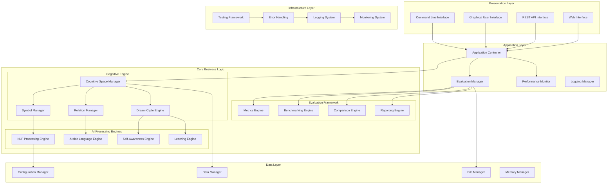

# Improved System Architecture - Morgen AI Paradigm

## Overview

This document presents a redesigned system architecture for the Morgen AI Paradigm that addresses the critical issues identified in the current implementation. The improved architecture emphasizes modularity, testability, professional standards, and clear separation of concerns.

## 1. High-Level Architecture Overview

## 2. Layer Descriptions

### 2.1 Presentation Layer
**Purpose**: User interaction and interface management

**Components**:
- **Command Line Interface**: Professional CLI with comprehensive options
- **Graphical User Interface**: Redesigned GUI with clear functionality
- **REST API Interface**: Programmatic access for integration
- **Web Interface**: Browser-based access for demonstrations

**Improvements**:
- Clear separation from business logic
- Standardized interface patterns
- Comprehensive error handling
- Professional user experience

### 2.2 Application Layer
**Purpose**: Application flow control and coordination

**Components**:
- **Application Controller**: Central coordination and workflow management
- **Evaluation Manager**: Performance evaluation and benchmarking coordination
- **Performance Monitor**: Real-time performance tracking and optimization
- **Logging Manager**: Centralized logging and audit trail management

**Improvements**:
- Single point of control for application flow
- Integrated evaluation and monitoring
- Professional logging and debugging capabilities
- Clear responsibility separation

### 2.3 Core Business Logic
**Purpose**: Core AI and cognitive processing functionality

#### Cognitive Engine
- **Cognitive Space Manager**: Central management of the cognitive space
- **Symbol Manager**: Symbol lifecycle and relationship management
- **Relation Manager**: Inter-symbol relationship processing
- **Dream Cycle Engine**: Core dream cycle processing with phases

#### AI Processing Engines
- **NLP Processing Engine**: Natural language processing capabilities
- **Arabic Language Engine**: Specialized Arabic language processing
- **Self-Awareness Engine**: Meta-cognitive processing
- **Learning Engine**: Adaptive learning and improvement

#### Evaluation Framework
- **Metrics Engine**: Performance metric calculation and tracking
- **Benchmarking Engine**: Standardized benchmark execution
- **Comparison Engine**: Comparative analysis with other systems
- **Reporting Engine**: Comprehensive reporting and visualization

**Improvements**:
- Clear functional separation
- Integrated evaluation framework
- Professional error handling
- Comprehensive testing support

### 2.4 Data Layer
**Purpose**: Data management and persistence

**Components**:
- **Data Manager**: Centralized data access and management
- **Configuration Manager**: System configuration and settings
- **File Manager**: File system operations and management
- **Memory Manager**: Memory allocation and optimization

**Improvements**:
- Centralized data access patterns
- Professional configuration management
- Efficient memory management
- Clear data flow control

### 2.5 Infrastructure Layer
**Purpose**: System infrastructure and support services

**Components**:
- **Testing Framework**: Comprehensive testing infrastructure
- **Error Handling**: Centralized error management and recovery
- **Logging System**: Professional logging and debugging
- **Monitoring System**: System health and performance monitoring

**Improvements**:
- Robust testing infrastructure
- Professional error handling patterns
- Comprehensive logging and monitoring
- System health management

## 3. Key Architectural Improvements

### 3.1 Modularity and Separation of Concerns
- **Clear Layer Boundaries**: Each layer has well-defined responsibilities
- **Interface Standardization**: Consistent interfaces between components
- **Dependency Management**: Clear dependency relationships and injection
- **Component Independence**: Components can be tested and developed independently

### 3.2 Testing and Quality Assurance
- **Testable Design**: Architecture designed for comprehensive testing
- **Mock and Stub Support**: Easy mocking of dependencies for unit testing
- **Integration Testing**: Clear integration points for system testing
- **Performance Testing**: Built-in performance monitoring and testing

### 3.3 Error Handling and Reliability
- **Centralized Error Handling**: Consistent error management across system
- **Graceful Degradation**: System continues operation despite component failures
- **Recovery Mechanisms**: Automatic recovery from common error conditions
- **Comprehensive Logging**: Detailed logging for debugging and monitoring

### 3.4 Performance and Scalability
- **Performance Monitoring**: Built-in performance tracking and optimization
- **Resource Management**: Efficient memory and resource utilization
- **Scalability Design**: Architecture supports horizontal and vertical scaling
- **Optimization Framework**: Systematic performance optimization capabilities

## 4. Implementation Strategy

### 4.1 Phase 1: Infrastructure Foundation
1. **Testing Framework Implementation**: Fix test infrastructure issues
2. **Error Handling System**: Implement centralized error management
3. **Logging System**: Professional logging and debugging capabilities
4. **Configuration Management**: Centralized configuration system

### 4.2 Phase 2: Core System Refactoring
1. **Layer Separation**: Implement clear layer boundaries
2. **Component Interfaces**: Standardize component interfaces
3. **Dependency Injection**: Implement dependency management
4. **Data Layer**: Centralize data access and management

### 4.3 Phase 3: Evaluation and Enhancement
1. **Evaluation Framework**: Implement comprehensive evaluation system
2. **Performance Monitoring**: Add performance tracking and optimization
3. **Benchmarking System**: Implement standardized benchmarking
4. **Reporting System**: Add comprehensive reporting capabilities

## 5. Benefits of Improved Architecture

### 5.1 Development Benefits
- **Maintainability**: Clear structure makes system easier to maintain
- **Testability**: Architecture designed for comprehensive testing
- **Extensibility**: Easy to add new features and capabilities
- **Debugging**: Professional debugging and monitoring capabilities

### 5.2 Research Benefits
- **Evaluation Framework**: Built-in performance evaluation and benchmarking
- **Reproducibility**: Clear interfaces and configuration for reproducible results
- **Comparison**: Systematic comparison with other systems
- **Documentation**: Architecture supports comprehensive documentation

### 5.3 Professional Benefits
- **Standards Compliance**: Meets professional development standards
- **Quality Assurance**: Built-in quality assurance and testing
- **Performance**: Optimized for performance and scalability
- **Reliability**: Robust error handling and recovery mechanisms

## 6. Migration Strategy

### 6.1 Backward Compatibility
- **Interface Preservation**: Maintain existing interfaces where possible
- **Gradual Migration**: Phased migration to new architecture
- **Legacy Support**: Support for existing functionality during transition
- **Documentation**: Clear migration documentation and guidelines

### 6.2 Risk Mitigation
- **Incremental Changes**: Small, incremental changes to reduce risk
- **Testing at Each Step**: Comprehensive testing after each change
- **Rollback Capability**: Ability to rollback changes if issues arise
- **Monitoring**: Continuous monitoring during migration process

---

**Architecture Version**: 2.0  
**Design Principles**: Modularity, Testability, Professional Standards  
**Implementation Approach**: Phased Migration with Risk Mitigation  
**Next Steps**: Proceed to T01.03 - Testing Strategy Design
