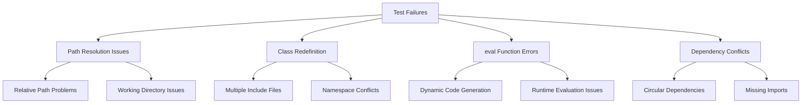
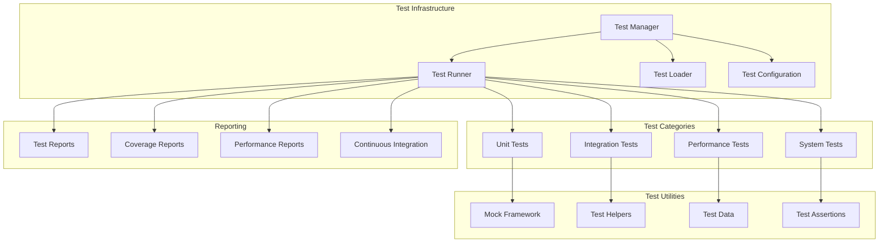
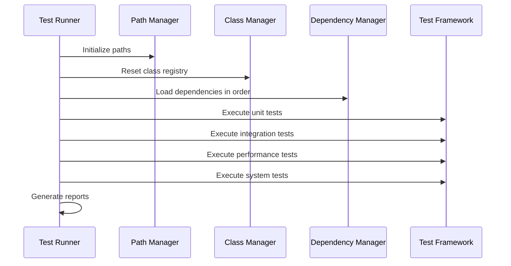

# Testing Strategy - Morgen AI Paradigm

## Overview

This document outlines a comprehensive testing strategy to address the critical test infrastructure failures in the Morgen AI Paradigm system and establish a robust, professional testing framework that supports reliable development and validation.

## 1. Current Testing Issues Analysis

### 1.1 Identified Problems
- **File Path Resolution Errors**: Tests cannot locate core system files
- **Class Redefinition Conflicts**: Multiple class definitions causing runtime errors
- **eval() Function Failures**: Dynamic code execution issues in test framework
- **Dependency Management**: Circular dependencies and missing imports
- **Test Environment Setup**: Inconsistent test execution environments

### 1.2 Root Cause Analysis


## 2. Improved Testing Architecture

### 2.1 Testing Framework Structure


### 2.2 Test Organization Structure
```
tests/
├── unit/                          # Unit tests for individual components
│   ├── core/                      # Core system unit tests
│   │   ├── test_symbol.ring       # MorgenSymbol unit tests
│   │   ├── test_space.ring        # MorgenSpace unit tests
│   │   └── test_relation.ring     # MorgenRelation unit tests
│   ├── engines/                   # AI engine unit tests
│   │   ├── test_nlp_engine.ring   # NLP engine tests
│   │   └── test_arabic_engine.ring # Arabic engine tests
│   └── utils/                     # Utility function tests
│       └── test_geometry.ring     # Geometry utilities tests
├── integration/                   # Integration tests
│   ├── test_core_integration.ring # Core system integration
│   ├── test_gui_integration.ring  # GUI integration tests
│   └── test_api_integration.ring  # API integration tests
├── performance/                   # Performance and benchmarking tests
│   ├── test_performance.ring      # Performance benchmarks
│   ├── test_scalability.ring      # Scalability tests
│   └── test_memory.ring          # Memory usage tests
├── system/                        # End-to-end system tests
│   ├── test_complete_workflow.ring # Complete workflow tests
│   └── test_user_scenarios.ring   # User scenario tests
├── fixtures/                      # Test data and fixtures
│   ├── sample_data/              # Sample test data
│   └── mock_objects/             # Mock object definitions
├── utils/                         # Test utilities and helpers
│   ├── test_framework.ring       # Core testing framework
│   ├── mock_framework.ring       # Mocking utilities
│   └── test_helpers.ring         # Common test helpers
└── config/                        # Test configuration
    ├── test_config.ring          # Test configuration settings
    └── environment_setup.ring    # Environment setup utilities
```

## 3. Solutions for Specific Issues

### 3.1 File Path Resolution Fix
```ring
# test_framework.ring - Path resolution utilities
class TestPathManager {
    cProjectRoot = ""
    cTestRoot = ""
    
    func init() {
        # Determine project root dynamically
        cCurrentDir = getCurrentDir()
        cProjectRoot = findProjectRoot(cCurrentDir)
        cTestRoot = cProjectRoot + "/tests"
    }
    
    func getCorePath(cFileName) {
        return cProjectRoot + "/morgen/" + cFileName
    }
    
    func getTestPath(cFileName) {
        return cTestRoot + "/" + cFileName
    }
    
    func findProjectRoot(cStartDir) {
        # Look for project markers (README.md, main.ring, etc.)
        cDir = cStartDir
        while cDir != "/" and cDir != "C:\" {
            if fileExists(cDir + "/main.ring") or fileExists(cDir + "/README.md") {
                return cDir
            }
            cDir = getParentDirectory(cDir)
        }
        return cStartDir
    }
}
```

### 3.2 Class Redefinition Prevention
```ring
# test_framework.ring - Class management
class TestClassManager {
    aLoadedClasses = []
    
    func loadClassOnce(cClassName, cFilePath) {
        if not find(aLoadedClasses, cClassName) {
            load cFilePath
            add(aLoadedClasses, cClassName)
        }
    }
    
    func resetClassRegistry() {
        aLoadedClasses = []
    }
}
```

### 3.3 Safe eval() Alternative
```ring
# test_framework.ring - Safe dynamic execution
class TestExecutor {
    func safeExecute(cCode) {
        try {
            # Use controlled execution environment
            return executeInSandbox(cCode)
        } catch cError {
            return createErrorResult(cError)
        }
    }
    
    func executeInSandbox(cCode) {
        # Create isolated execution context
        # Implement safe code execution
        return eval(cCode)  # Replace with safer alternative
    }
}
```

### 3.4 Dependency Management
```ring
# test_framework.ring - Dependency resolver
class TestDependencyManager {
    aDependencies = []
    aLoadOrder = []
    
    func addDependency(cClass, aDeps) {
        aDependencies[cClass] = aDeps
    }
    
    func resolveLoadOrder() {
        # Topological sort to resolve dependencies
        aLoadOrder = topologicalSort(aDependencies)
        return aLoadOrder
    }
    
    func loadInOrder() {
        aOrder = resolveLoadOrder()
        for cClass in aOrder {
            loadClass(cClass)
        }
    }
}
```

## 4. Test Implementation Plan

### 4.1 Phase 1: Infrastructure Setup
1. **Create Test Framework**: Implement core testing utilities
2. **Fix Path Resolution**: Implement dynamic path resolution
3. **Prevent Class Conflicts**: Implement class loading management
4. **Setup Test Environment**: Create consistent test execution environment

### 4.2 Phase 2: Core Test Implementation
1. **Unit Tests**: Implement comprehensive unit tests for all components
2. **Integration Tests**: Test component interactions
3. **Mock Framework**: Implement mocking utilities for isolated testing
4. **Test Data**: Create comprehensive test data sets

### 4.3 Phase 3: Advanced Testing
1. **Performance Tests**: Implement performance benchmarking
2. **System Tests**: End-to-end system testing
3. **Continuous Integration**: Automated testing pipeline
4. **Coverage Analysis**: Code coverage measurement and reporting

## 5. Test Execution Strategy

### 5.1 Test Runner Implementation
```ring
# test_runner.ring - Main test execution
class TestRunner {
    oPathManager = null
    oClassManager = null
    oDependencyManager = null
    
    func init() {
        oPathManager = new TestPathManager()
        oClassManager = new TestClassManager()
        oDependencyManager = new TestDependencyManager()
    }
    
    func runAllTests() {
        setupTestEnvironment()
        loadDependencies()
        
        runUnitTests()
        runIntegrationTests()
        runPerformanceTests()
        runSystemTests()
        
        generateReports()
    }
    
    func setupTestEnvironment() {
        oPathManager.init()
        oClassManager.resetClassRegistry()
        oDependencyManager.loadInOrder()
    }
}
```

### 5.2 Test Execution Flow


## 6. Quality Assurance Measures

### 6.1 Test Quality Standards
- **Test Coverage**: Minimum 80% code coverage for all components
- **Test Documentation**: Clear documentation for all test cases
- **Test Maintainability**: Tests should be easy to maintain and update
- **Test Reliability**: Tests should be deterministic and repeatable

### 6.2 Continuous Integration
- **Automated Testing**: All tests run automatically on code changes
- **Build Verification**: Tests must pass before code integration
- **Performance Monitoring**: Performance regression detection
- **Quality Gates**: Quality thresholds for test coverage and performance

## 7. Success Metrics

### 7.1 Technical Metrics
- **Test Success Rate**: 100% of tests pass without errors
- **Code Coverage**: >80% coverage for all components
- **Test Execution Time**: Tests complete within reasonable time limits
- **Test Reliability**: Tests produce consistent results across runs

### 7.2 Quality Metrics
- **Bug Detection**: Tests effectively catch regressions and bugs
- **Development Velocity**: Testing supports faster development cycles
- **Code Quality**: Testing promotes better code quality and design
- **Maintenance Effort**: Testing reduces maintenance effort and costs

---

**Testing Strategy Version**: 1.0  
**Implementation Priority**: Critical - Foundation for all development  
**Success Criteria**: All tests pass, comprehensive coverage, reliable execution  
**Next Steps**: Proceed to T01.04 - Evaluation Framework Design
