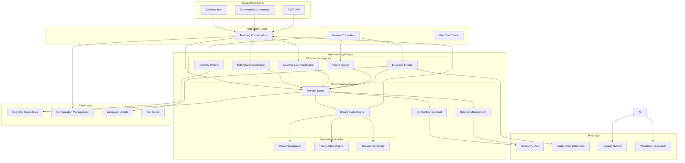
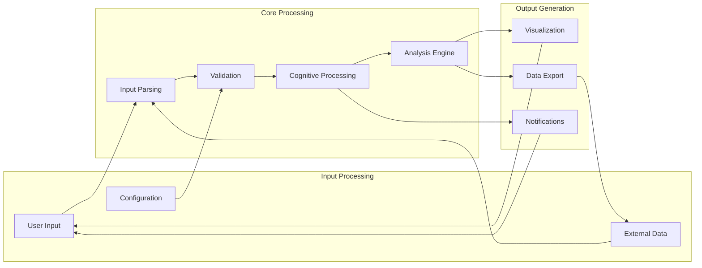
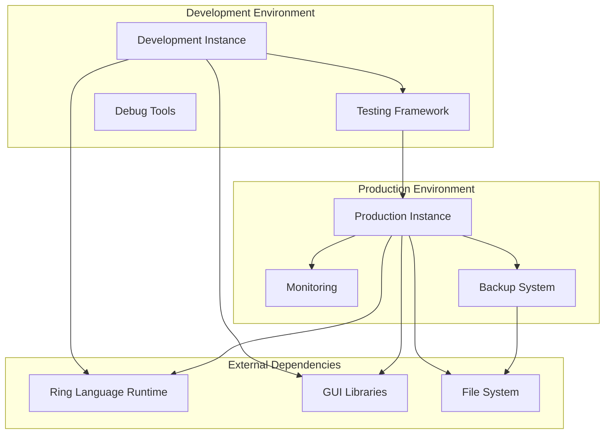

# Architecture Diagram - Morgen AI Paradigm

## Overview

This document presents the high-level architecture of the Morgen AI Paradigm system, illustrating the major components, their relationships, and the overall system structure.

## System Architecture Overview

## Layer Descriptions

### 1. Presentation Layer
**Purpose**: User interaction and external interfaces

#### Components:
- **GUI Interface**: Rich graphical interface for interactive exploration
- **Command Line Interface**: Text-based interface for scripting and automation
- **REST API**: Web service interface for external system integration

#### Responsibilities:
- User input handling
- Result visualization
- External system communication
- Interface state management

### 2. Application Layer
**Purpose**: Application flow control and coordination

#### Components:
- **Main Controller**: Central application coordinator
- **Feature Controllers**: Specialized controllers for advanced features
- **User Controllers**: User session and preference management

#### Responsibilities:
- Request routing
- Session management
- Feature orchestration
- User experience coordination

### 3. Business Logic Layer
**Purpose**: Core AI functionality and cognitive processing

#### Core Cognitive Engine:
- **Morgen Space**: Central cognitive space management
- **Symbol Management**: Symbol lifecycle and operations
- **Relation Management**: Inter-symbol relationship handling
- **Dream Cycle Engine**: Three-phase cognitive processing

#### Advanced AI Engines:
- **Self-Awareness Engine**: System introspection and meta-cognition
- **Adaptive Learning Engine**: Dynamic learning and optimization
- **Insight Engine**: Pattern recognition and insight generation
- **Linguistic Engine**: Natural language processing
- **Memory System**: Multi-type memory management

#### Processing Modules:
- **Wave Propagation**: Meaning wave dynamics
- **Triangulation Engine**: Emergent structure formation
- **Galactic Clustering**: Self-organizing knowledge structures
- **Meaning Condensation**: Semantic compression and distillation

### 4. Data Layer
**Purpose**: Data persistence and management

#### Components:
- **Cognitive Space Data**: Symbol and relation persistence
- **Configuration Management**: System configuration storage
- **Language Models**: Arabic language processing data
- **Test Suites**: Automated testing data and scenarios

### 5. Utility Layer
**Purpose**: Cross-cutting concerns and shared utilities

#### Components:
- **Geometry Utils**: Mathematical and geometric calculations
- **Arabic Char Definitions**: Arabic language character mappings
- **Logging System**: System-wide logging and monitoring
- **Validation Framework**: Data and operation validation

## Architectural Patterns

### 1. Layered Architecture
- Clear separation of concerns
- Unidirectional dependencies (top-down)
- Modular and maintainable structure

### 2. Model-View-Controller (MVC)
- **Model**: Cognitive space and AI engines
- **View**: GUI and visualization components
- **Controller**: Application and feature controllers

### 3. Observer Pattern
- Event-driven communication between components
- Loose coupling between layers
- Real-time updates and notifications

### 4. Strategy Pattern
- Pluggable algorithms for learning and processing
- Configurable behavior adaptation
- Runtime strategy selection

### 5. Factory Pattern
- Centralized object creation
- Type-safe instantiation
- Configuration-driven object creation

## Data Flow Architecture

## Component Interaction Patterns

### 1. Synchronous Processing
- Direct method calls for immediate operations
- Used for: Symbol creation, basic calculations, validation

### 2. Asynchronous Processing
- Event-driven processing for long-running operations
- Used for: Dream cycles, wave propagation, learning processes

### 3. Pipeline Processing
- Sequential processing through multiple stages
- Used for: Text processing, insight generation, memory consolidation

### 4. Parallel Processing
- Concurrent execution of independent operations
- Used for: Multiple wave propagation, batch symbol processing

## Scalability Considerations

### Horizontal Scaling
- Distributed cognitive space processing
- Load balancing across multiple instances
- Microservice decomposition potential

### Vertical Scaling
- Memory optimization for large symbol spaces
- CPU optimization for intensive calculations
- Storage optimization for persistent data

### Performance Optimization
- Caching frequently accessed symbols
- Lazy loading of complex structures
- Batch processing for bulk operations

## Security Architecture

### Access Control
- Role-based access to different system features
- API authentication and authorization
- Configuration protection

### Data Protection
- Sensitive cognitive data encryption
- Secure communication channels
- Audit logging for critical operations

### System Integrity
- Input validation and sanitization
- Error handling and recovery
- System state consistency checks

## Deployment Architecture

## Technology Stack

### Core Technologies
- **Programming Language**: Ring Language
- **GUI Framework**: Ring GUI Library (Objects Library)
- **Data Storage**: File-based persistence
- **Configuration**: Ring configuration files

### Development Tools
- **Testing**: Custom Ring testing framework
- **Documentation**: Markdown with Mermaid diagrams
- **Version Control**: Git (implied)
- **Build System**: Ring interpreter

### Runtime Dependencies
- Ring Language interpreter
- Operating system file system access
- GUI library support
- Memory management system

---

**Document Version**: 1.0  
**Last Updated**: 2025-01-25  
**Related Documents**: 
- `class_diagram.md` - Detailed class structure
- `sequence_diagram.md` - Component interactions
- `../documentation/technical_specification.md` - Implementation details
