# Class Diagram - Morgen AI Paradigm

## Overview

This document presents the class diagram for the Morgen AI Paradigm system, showing the core classes, their attributes, methods, and relationships.

## Core Classes

### MorgenSymbol Class

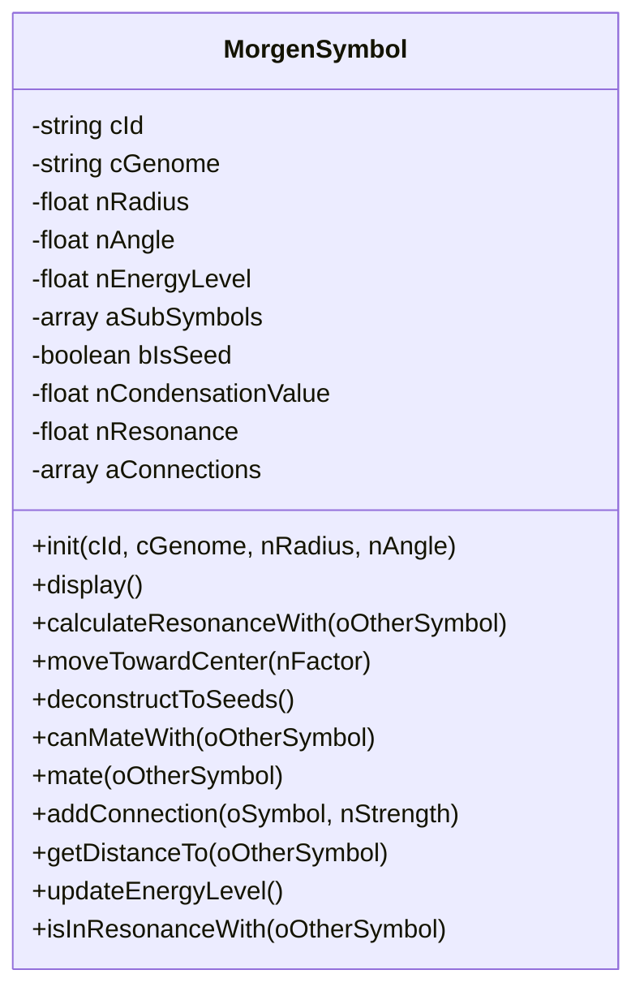

### MorgenSpace Class

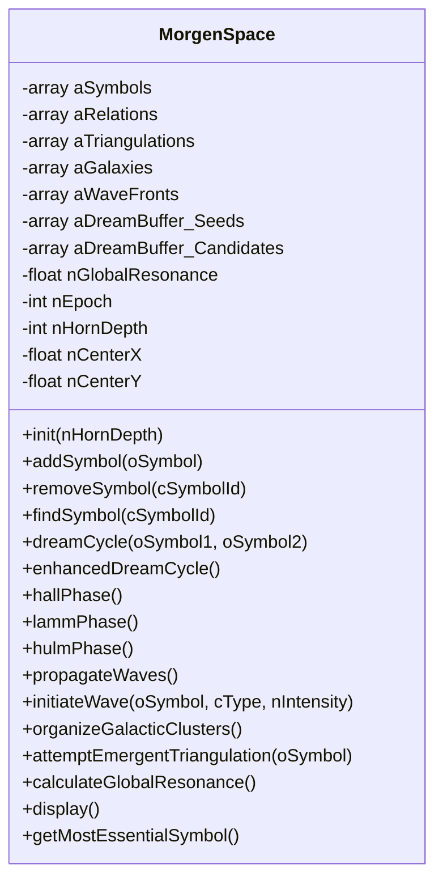

### MorgenRelation Class

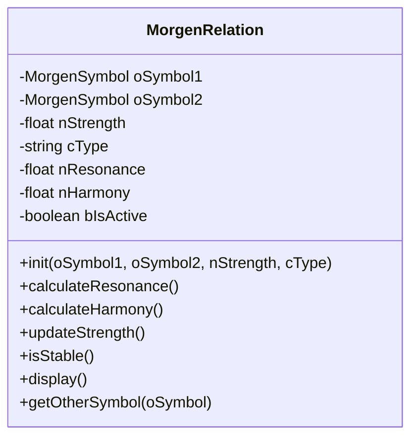

## Advanced AI Classes

### SelfAwarenessEngine Class

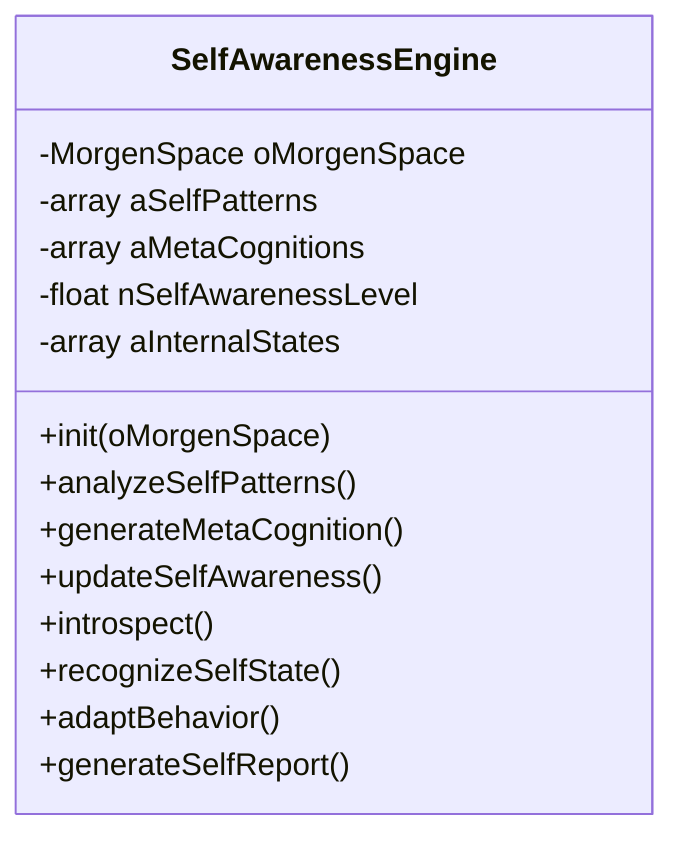

### AdaptiveLearningEngine Class

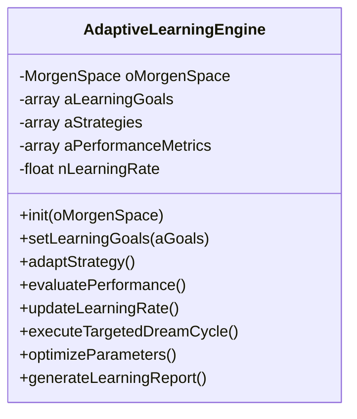

### MemorySystem Class

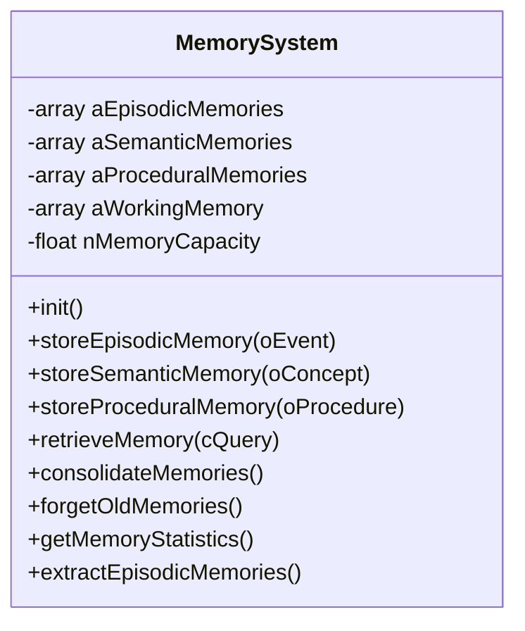

## Utility Classes

### GeometryUtils Class

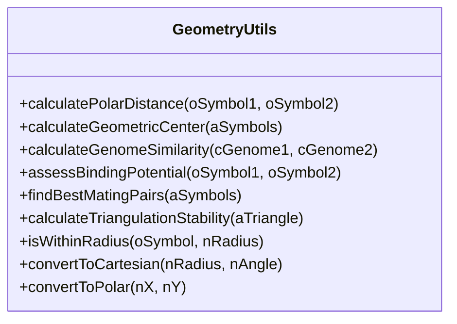

### ArabicCharDefinitions Class

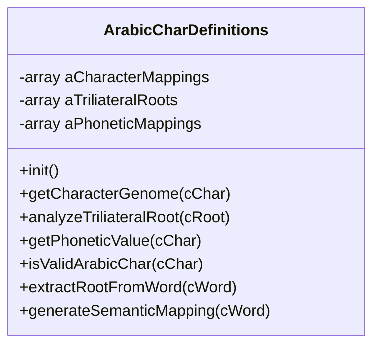

## GUI Classes

### MainWindowController Class

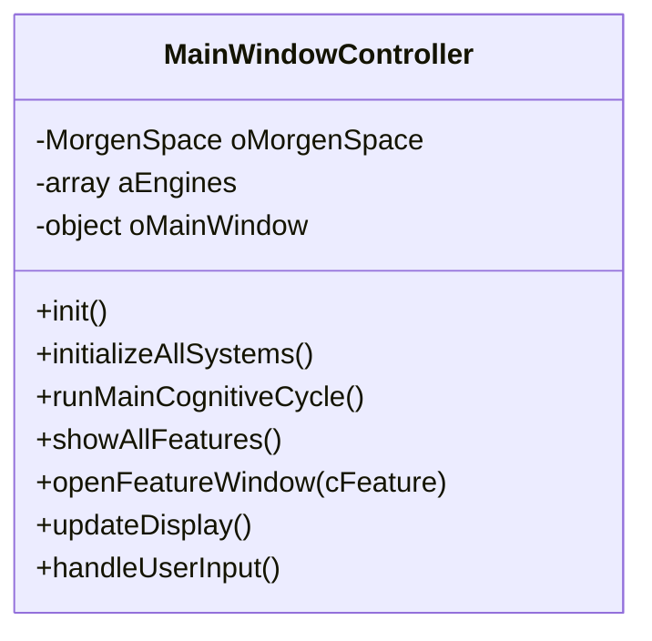

## Class Relationships

```mermaid
classDiagram
    MorgenSpace ||--o{ MorgenSymbol : contains
    MorgenSpace ||--o{ MorgenRelation : manages
    MorgenRelation ||--|| MorgenSymbol : connects
    MorgenSpace ||--|| SelfAwarenessEngine : uses
    MorgenSpace ||--|| AdaptiveLearningEngine : uses
    MorgenSpace ||--|| MemorySystem : uses
    MorgenSymbol ||--|| GeometryUtils : uses
    MorgenSpace ||--|| GeometryUtils : uses
    ArabicCharDefinitions ||--|| MorgenSymbol : creates
    MainWindowController ||--|| MorgenSpace : controls
    MainWindowController ||--o{ SelfAwarenessEngine : manages
    MainWindowController ||--o{ AdaptiveLearningEngine : manages
    MainWindowController ||--o{ MemorySystem : manages
```

## Key Design Patterns

### Observer Pattern
- **MorgenSpace** notifies observers when symbols are added/removed
- **GUI Controllers** observe space changes for display updates

### Strategy Pattern
- **AdaptiveLearningEngine** uses different learning strategies
- **Wave propagation** uses different propagation strategies

### Factory Pattern
- **MorgenSymbol** creation through factory methods
- **Relation** creation based on symbol types

### Composite Pattern
- **MorgenSymbol** can contain sub-symbols
- **Triangulations** compose multiple symbols

## Inheritance Hierarchy

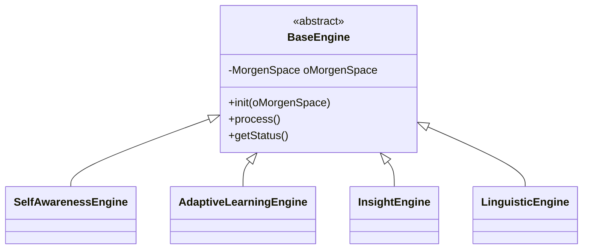

## Interface Definitions

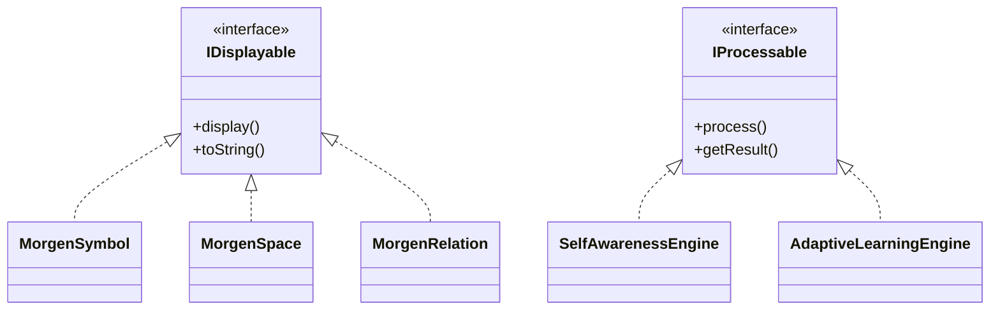

---

**Document Version**: 1.0  
**Last Updated**: 2025-01-25  
**Related Documents**: 
- `use_case_diagram.md` - System use cases
- `sequence_diagram.md` - Operation sequences
- `../documentation/api_reference.md` - Detailed API documentation
