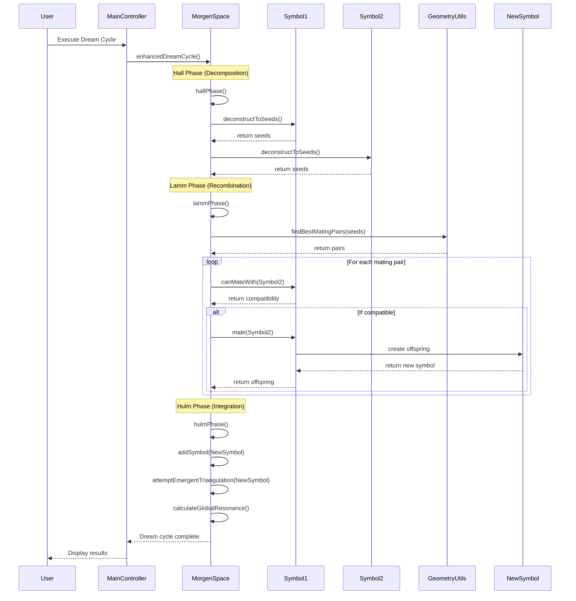
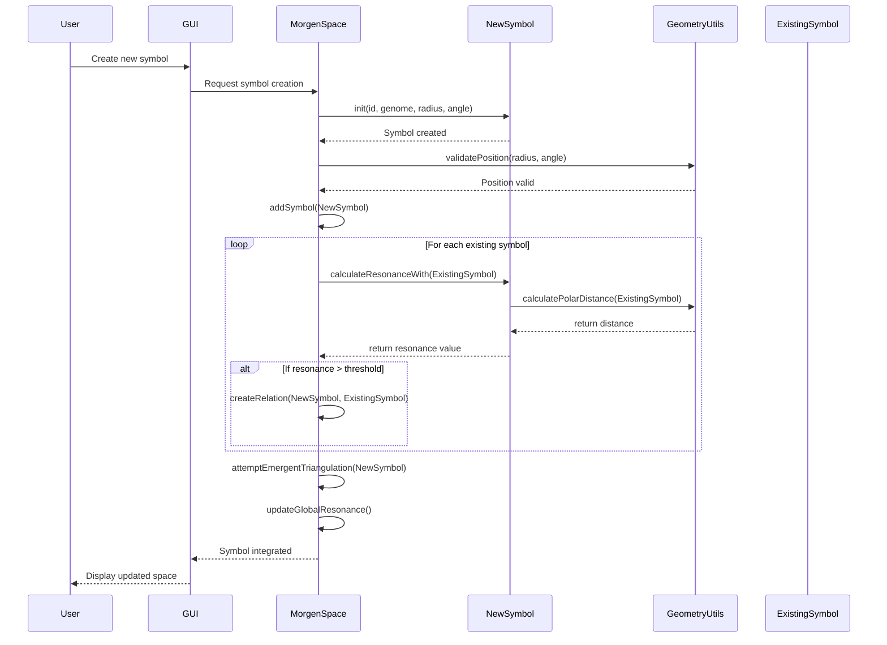
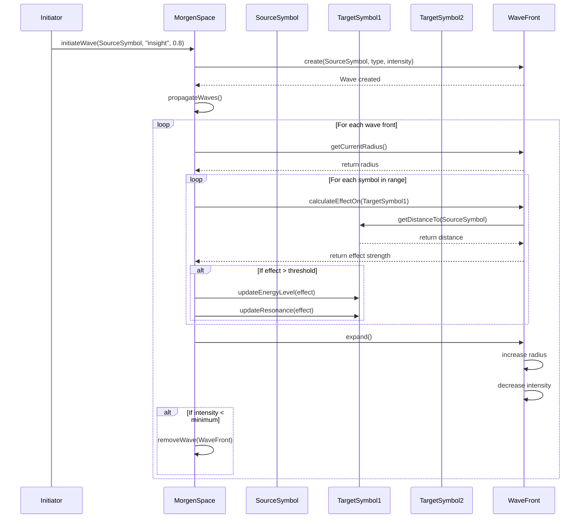
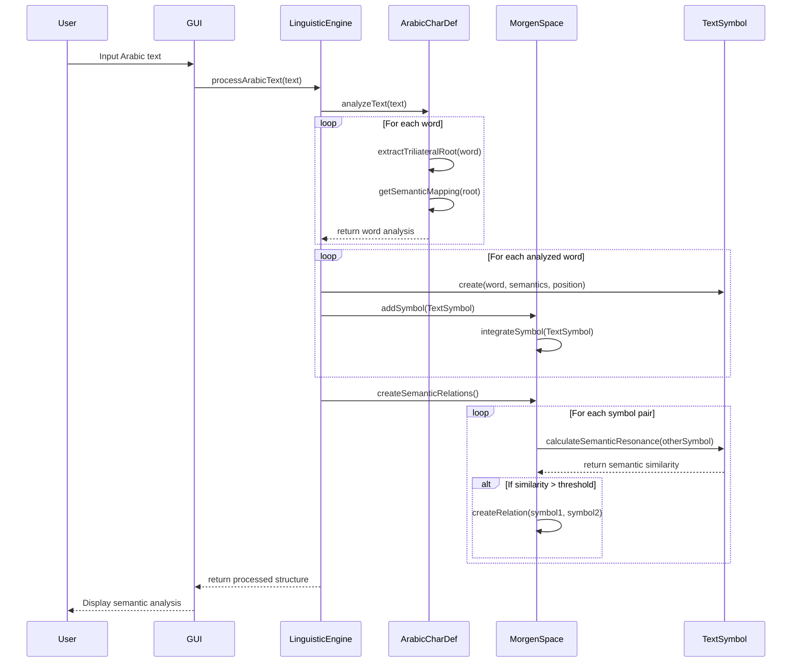
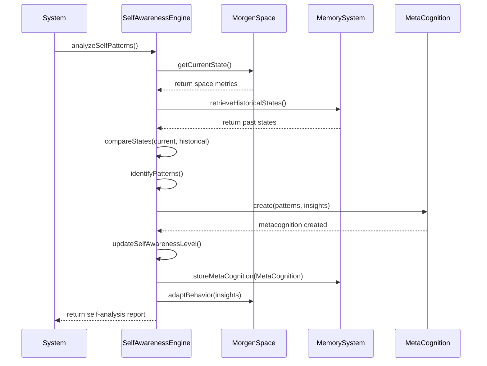
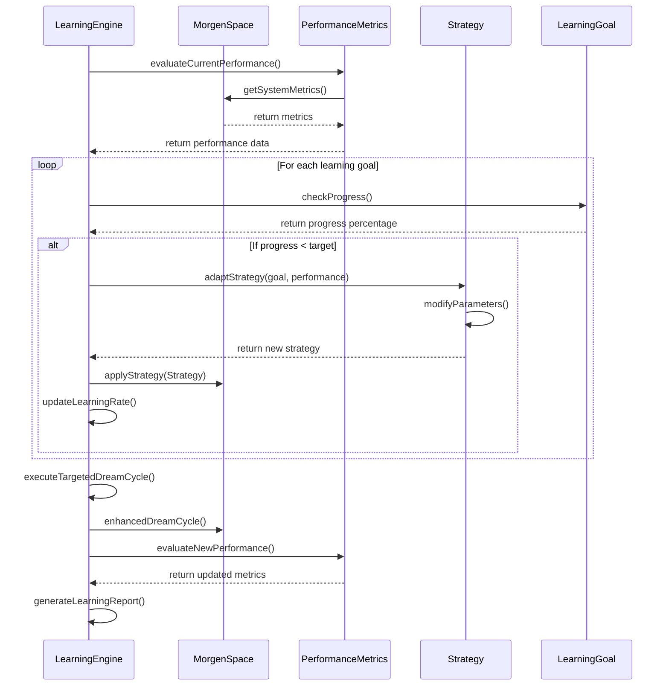

# Sequence Diagram - Morgen AI Paradigm

## Overview

This document presents sequence diagrams for key operations in the Morgen AI Paradigm system, illustrating the interactions between different components over time.

## 1. Dream Cycle Execution Sequence

## 2. Symbol Creation and Integration Sequence

## 3. Wave Propagation Sequence

## 4. Arabic Text Processing Sequence

## 5. Self-Awareness Analysis Sequence

## 6. Adaptive Learning Sequence

## Timing Considerations

### Performance Characteristics
- **Symbol Creation**: O(n) where n is number of existing symbols
- **Dream Cycle**: O(n²) for symbol interactions, O(n) for integration
- **Wave Propagation**: O(n×m) where n is symbols and m is active waves
- **Text Processing**: O(k) where k is text length
- **Self-Awareness**: O(n) for pattern analysis
- **Adaptive Learning**: O(g×s) where g is goals and s is strategies

### Critical Paths
1. Dream cycle execution (most computationally intensive)
2. Wave propagation with multiple active waves
3. Large-scale text processing
4. Real-time GUI updates during processing

---

**Document Version**: 1.0  
**Last Updated**: 2025-01-25  
**Related Documents**: 
- `class_diagram.md` - Class structure and relationships
- `use_case_diagram.md` - System use cases
- `../documentation/technical_specification.md` - Detailed technical specs
