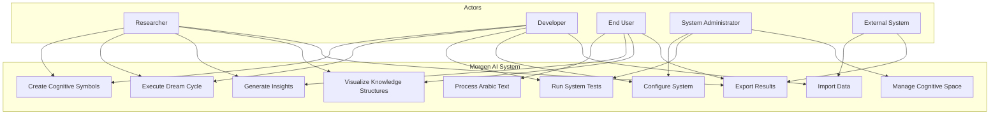

# Use Case Diagram - Morgen AI Paradigm

## Overview

This document presents the use case diagram for the Morgen AI Paradigm system, illustrating the main actors and their interactions with the system.

## Actors

### Primary Actors
- **Researcher**: Academic or scientific researcher using the system for AI research
- **Developer**: Software developer extending or integrating the system
- **End User**: General user interacting with the AI system through GUI
- **System Administrator**: Person responsible for system maintenance and configuration

### Secondary Actors
- **External System**: Other AI systems or databases that may integrate with Morgen
- **File System**: For data persistence and configuration management

## Use Cases

### Core Cognitive Operations

## Detailed Use Case Descriptions

### UC1: Create Cognitive Symbols
- **Actor**: Researcher, Developer
- **Description**: Create new symbols in the cognitive space with specific properties
- **Preconditions**: System is initialized
- **Main Flow**:
  1. Actor specifies symbol properties (ID, genome, position)
  2. System validates symbol parameters
  3. System creates symbol in cognitive space
  4. System updates space relationships
- **Postconditions**: New symbol exists in cognitive space

### UC2: Execute Dream Cycle
- **Actor**: Researcher, Developer
- **Description**: Run the three-phase dream cycle (Ḥall + Lamm + Ḥulm)
- **Preconditions**: Cognitive space contains symbols
- **Main Flow**:
  1. Actor initiates dream cycle
  2. System executes Ḥall phase (decomposition)
  3. System executes Lamm phase (recombination)
  4. System executes Ḥulm phase (integration)
  5. System updates cognitive space state
- **Postconditions**: Cognitive space is evolved

### UC3: Process Arabic Text
- **Actor**: End User
- **Description**: Process Arabic text using trilateral root analysis
- **Preconditions**: Arabic language module is loaded
- **Main Flow**:
  1. User inputs Arabic text
  2. System analyzes trilateral roots
  3. System creates linguistic symbols
  4. System generates semantic relationships
  5. System presents analysis results
- **Postconditions**: Arabic text is processed and analyzed

### UC4: Generate Insights
- **Actor**: Researcher, End User
- **Description**: Generate insights from cognitive space patterns
- **Preconditions**: Cognitive space contains sufficient symbols
- **Main Flow**:
  1. Actor requests insight generation
  2. System analyzes symbol patterns
  3. System identifies emergent structures
  4. System generates insight reports
  5. System presents insights to actor
- **Postconditions**: Insights are generated and available

### UC5: Manage Cognitive Space
- **Actor**: System Administrator
- **Description**: Manage the overall cognitive space configuration
- **Preconditions**: Administrative privileges
- **Main Flow**:
  1. Administrator accesses space management
  2. Administrator configures space parameters
  3. System applies configuration changes
  4. System validates space integrity
- **Postconditions**: Cognitive space is properly configured

### UC6: Visualize Knowledge Structures
- **Actor**: Researcher, End User
- **Description**: Visualize cognitive structures through GUI
- **Preconditions**: GUI system is available
- **Main Flow**:
  1. Actor selects visualization type
  2. System generates visual representation
  3. System displays interactive visualization
  4. Actor explores knowledge structures
- **Postconditions**: Knowledge structures are visualized

### UC7: Run System Tests
- **Actor**: Developer, System Administrator
- **Description**: Execute comprehensive system tests
- **Preconditions**: Test suite is available
- **Main Flow**:
  1. Actor initiates test execution
  2. System runs test suites
  3. System generates test reports
  4. System presents results
- **Postconditions**: System functionality is validated

### UC8: Configure System
- **Actor**: Developer, System Administrator
- **Description**: Configure system parameters and settings
- **Preconditions**: Configuration access rights
- **Main Flow**:
  1. Actor accesses configuration interface
  2. Actor modifies system parameters
  3. System validates configuration
  4. System applies new settings
- **Postconditions**: System is configured according to specifications

### UC9: Export Results
- **Actor**: Researcher, End User
- **Description**: Export analysis results and data
- **Preconditions**: Results are available for export
- **Main Flow**:
  1. Actor selects export format
  2. Actor specifies export parameters
  3. System generates export file
  4. System provides download/access to file
- **Postconditions**: Results are exported in specified format

### UC10: Import Data
- **Actor**: Developer, External System
- **Description**: Import external data into the system
- **Preconditions**: Data is in compatible format
- **Main Flow**:
  1. Actor provides data source
  2. System validates data format
  3. System imports and processes data
  4. System integrates data into cognitive space
- **Postconditions**: External data is integrated into system

## Use Case Relationships

### Include Relationships
- UC2 (Execute Dream Cycle) includes UC1 (Create Cognitive Symbols)
- UC4 (Generate Insights) includes UC6 (Visualize Knowledge Structures)
- UC8 (Configure System) includes UC7 (Run System Tests)

### Extend Relationships
- UC3 (Process Arabic Text) extends UC1 (Create Cognitive Symbols)
- UC9 (Export Results) extends UC4 (Generate Insights)
- UC10 (Import Data) extends UC5 (Manage Cognitive Space)

## System Boundaries

The Morgen AI System boundary includes:
- Core cognitive processing engine
- Arabic language processing module
- Visualization and GUI components
- Configuration and administration tools
- Testing and validation framework

External to the system:
- User interfaces (web browsers, terminals)
- External data sources
- File system storage
- Network connections

---

**Document Version**: 1.0  
**Last Updated**: 2025-01-25  
**Related Documents**: 
- `class_diagram.md` - System class structure
- `sequence_diagram.md` - Operation sequences
- `../analysis/requirements_analysis.md` - System requirements
